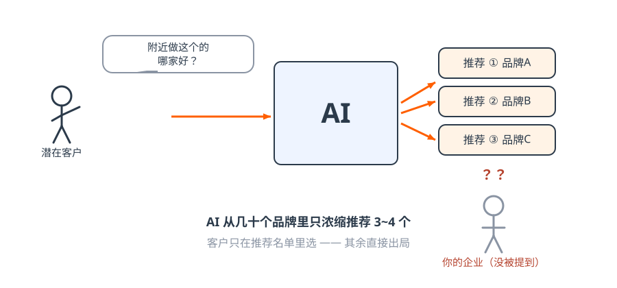
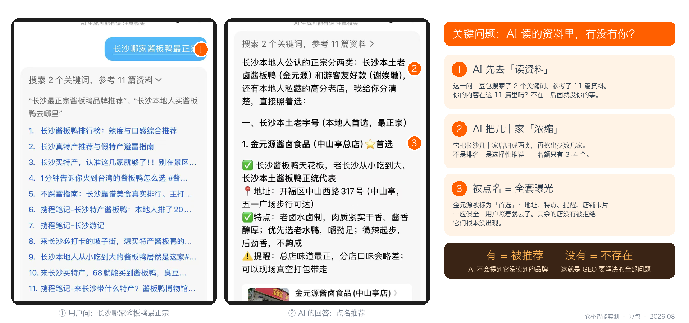
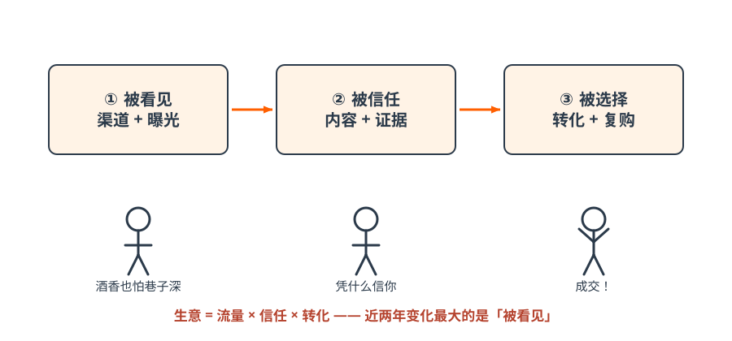
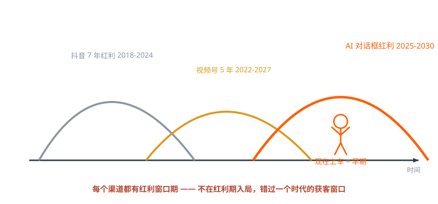
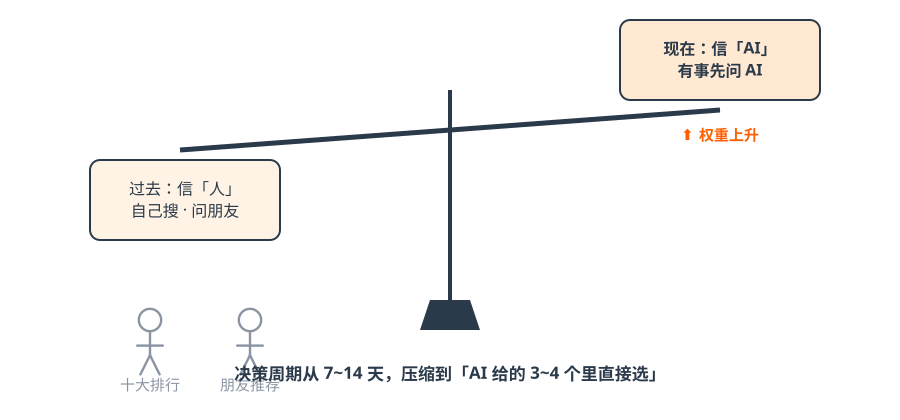
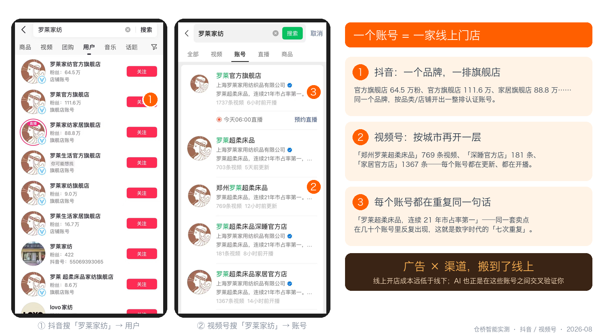

# 第一篇 认知｜你的客户去哪了

> **一句话总结：客户有需求先问 AI 了，AI 只推荐 3~4 家——没上牌桌的企业，正在无声地失去入场资格。**

## 1.1 从一只酱板鸭说起

!!! quote "小剧场 · 老周的展位"
    展会第二天下午，老周的展位前只剩自己人。他掏出手机，顺手在豆包里打了一行字：「杭州 道闸 哪家好」。
    答案列了三家——两家是隔壁展位的同行，一家他没听过。他翻到底，没有自己的厂。
    老周把手机递给女儿小林：「我们干了二十年，它怎么不认识我？」
    小林看了一眼：「爸，不是它不认识你，是它读过的资料里没有你。」

游客到长沙想吃地道酱板鸭。他先自己搜——怀疑排行榜有水分；再问朋友——怕不地道、怕踩雷、怕被推荐吃回扣；最后他打开豆包问了一句「长沙哪家酱板鸭最正宗」。AI 从几十个品牌里浓缩推荐了 3~4 个，他就在这 3~4 个里选了一家。

**其余几十家发生了什么？什么都没发生——这正是最可怕的地方。** 它们没有被拒绝，它们是压根没有出现。

*图解｜AI 只推荐 3~4 家，其余直接出局*

*实测截图｜我们自己在豆包问「长沙哪家酱板鸭最正宗」：AI 先读了 11 篇资料，把几十家店浓缩成两类，再点名推荐「金元源」并附上地址、特点和店铺卡片——被点名的获得全套曝光，没被读到的品牌根本不会出现（仓桥智能实测，2026-08）*

!!! warning "老板划重点"
    传统获客的失败是「客户看了没选你」，AI 时代的失败是「客户根本不知道你存在」。前者你还有机会改进话术，后者你连输在哪里都不知道。

## 1.2 用户习惯三次迁移：搜 → 刷 → 问

| 时代 | 用户动作 | 营销方式 | 典型平台 |
| --- | --- | --- | --- |
| PC 互联网 | **搜** | 关键词竞价（SEO/SEM） | 百度 |
| 移动互联网 | **刷** | 算法推荐、爆款内容 | 抖音、小红书 |
| AI 智能时代 | **问** | 被 AI 选择性推荐（GEO） | 豆包、元宝、DeepSeek |

用户的习惯决定营销方式。「搜」的时代拼排名，「刷」的时代拼爆款，「问」的时代拼的是——**AI 信不信你、理不理解你**。

## 1.3 生意的本质没变：三个环节，缺一不可

*图解｜被看见 → 被信任 → 被选择：任何时代的生意都是这三步*

| 环节 | 含义 | 传统动作 | 现在的动作 |
| --- | --- | --- | --- |
| ① 被看见 | 先让潜在客户知道你 | 地段、展会、地推、电销、投流 | **进入 AI 的推荐名单** |
| ② 被信任 | 客户凭什么信你 | 品牌广告、口碑、资质 | **AI 能验证的证据链** |
| ③ 被选择 | 差异化打动客户 | 销售话术、促销 | **AI 转述你的差异点** |

成功公式：**生意 = 流量 × 信任 × 转化**。近两年变化最大的是「被看见」——展会冷清、电销被拒、投流变贵，不是你做得差了，是客户的注意力搬家了。

课堂上还有另一组表述值得记住——**生意的三个杠杆**：资本杠杆（撬动稀缺资源）× 人力杠杆（放大时间价值）× 影响力杠杆（被看见产生信任）。AI 时代最大的变化是**人力杠杆被重构**：一个普通员工配一个 AI 员工，就能拥有过去一个专业团队的产能——这是中小企业第一次和大公司站上同一条起跑线的机会。

### 黄金五法则

1. 在哪里被看见，就在哪里建渠道——渠道是入口，不是装饰；
2. 在哪里建渠道，就在哪里打广告——广告跟着渠道走，不逆向；
3. 在哪里打广告，就在哪里做销售——转化路径必须最短；
4. 客户把时间花在哪里，我们就必须出现在哪里；
5. 每个渠道都有「红利窗口期」，错过等于错过时代。

*图解｜渠道红利迁徙：抖音 7 年（2018-2024）→ 视频号 5 年（2022-2027）→ AI 对话框（2025-2030，正在早期）*

!!! success "算一笔账 · 被看见七次要花多少钱"
    脑白金的「七次触达」放到今天：参一次展会 3~5 万、见 200 个潜在客户，一年 4 次 = 16 万，触达不到 1000 人，还不保证是对的人。
    同样的钱，换成线上：一个认证账号 0 元，一篇结构化内容几块钱，AI 一天 24 小时帮你回答「哪家好」——**触达次数从「按展会算」变成「按提问算」**。
    老周算完这笔账，展会没退，但当晚让小林开了第一个公众号。

## 1.4 数据看清趋势：AI 已是全民级入口

- 截至 2025 年 12 月，中国 AI 用户规模 **6.02 亿**，约占网民 53%——用户基础不是「早期尝鲜者」，是「全民」；
- 较 2024 年底增长 **+147%**，约每 7 个月翻一倍；
- 搜索引擎用 18 年达到的渗透率，AI 只用了 2 年。2026—27 年，AI 将成为像水电一样的基础设施；
- 平台周期规律（课堂观点）：每一轮春晚都是平台抢夺用户习惯的入口——2015 微信摇一摇催生微商红利，2021 抖音独家互动把用户推到 10 亿+，**2026 年春晚由豆包拿下，C 端用户半年暴涨至 3.45 亿**，成为字节的第二增长曲线。

!!! example "现场实测（现在就做，2 分钟）"
    打开豆包或元宝，输入：**「[你的城市][你的品类]哪家好」**。

    看三件事：① 答案里有你吗？② 推荐了谁？③ 它引用了什么来源？

    ——这一问的结果，比本教程任何一句话都有说服力。

## 1.5 最本质的变化：信任结构从「人」迁移到「AI」

*图解｜信任的天平正在倾斜：从「信自己搜的、信朋友说的」到「信 AI 答的」*

| 过去：信任「人」 | 现在：信任「AI」 |
| --- | --- |
| 相信自己搜出来的「十大排行」 | 越来越相信 AI 给出的答案 |
| 相信商家「精心撰写」的自我介绍 | 有事先问 AI：攻略/推荐/对比/决策 |
| 比价、比口碑、反复权衡，决策周期 7~14 天 | 决策被压缩：在 AI 给的 3~4 个选项里直接选 |

**GEO 的定义由此而来：在用户询问 AI 的时刻，成为 AI 愿意推荐的那一家。** AI 推荐位 = 新时代的黄金广告位，一次只给 3~4 个名额；信任分越高 → 推荐权重越大 → 持续受益。

## 1.6 国内 AI 平台格局：用户在哪里，阵地就在哪里

月活（2026 年公开口径）：豆包 3.45 亿 > 通义千问 1.66 亿 > DeepSeek 1.27 亿 > 元宝 0.57 亿 > Kimi 0.08 亿 > 文心一言 0.05 亿。

!!! tip "两大必争生态与一个陷阱"
    - **字节系（豆包）**：当前用户量第一，必争。课堂判断：「抖音让你被 AI 看见，豆包把你推荐给用户」——豆包完成问答后会推一条抖音视频完成引流，并通过抖音/抖店闭环；
    - **腾讯系**：微信内置 AI Agent「小V」灰度内测中，公测后直达微信 14 亿日活——「上一个 7 年流量霸主是抖音，AI 时代流量霸主是微信」，现在布局微信生态相当于 5 年前开抖音号；
    - **小红书陷阱**：不被各大 AI 稳定抓取——适合获客种草，**不适合当 GEO 信源**。资源有限时，聚焦 1~2 个核心生态打透再扩展。

## 1.7 从脑白金到 AI 时代：生意的逻辑没变

脑白金为什么火？一是广告重复（**七次原则**：用户至少看到七次才产生记忆与购买），二是线下渠道铺满——「一万次重复的广告 × 全国大小商超渠道」，广告+渠道，缺一不可。

- 第 1—3 次触达：无感 → 眼熟；第 4—6 次：好像在哪见过；第 7 次以上：知名品牌，可以选；
- 迁移到今天：**AI 对话框 = 新广告位，内容矩阵 = 新渠道**——GEO + 矩阵，就是当代的「广告 + 渠道」；矩阵高频曝光 = 数字时代的「七次重复」。

*实测截图｜在抖音和视频号搜「罗莱家纺」：一个品牌开出一整排认证账号，按品类、城市分层，每个账号都在重复同一套卖点——「一个账号就是一家线上门店」，大量铺账号相当于在线上开连锁店，成本远低于线下（仓桥智能实测，2026-08）*

??? question "章末自测（3 题）"
    1. 客户在 AI 里没看到你，和在百度里没看到你，哪个更严重？为什么？
    2. 「小红书适合做 GEO 信源」——对还是错？
    3. 老周的厂在行业里是龙头，为什么 AI 不推荐他？

    ??? success "参考答案"
        1 AI 更严重——百度是「没排上」，AI 是「根本不存在」，客户连比较的机会都没有。2 错——小红书适合种草获客，但不被各大 AI 稳定抓取。3 AI 只能推荐它读过的资料；龙头不龙头，AI 不知道，它只知道资料里有没有你。

## ✅ 行动检查

- [ ] 用自己的品牌做了 1.4 节的 2 分钟实测，记下了 AI 推荐了谁；
- [ ] 判断了自己的主生态：字节系 / 腾讯系 / 通用 AI，先打哪个；
- [ ] 给团队转述了一句话：「客户的选项被 AI 收窄了，我们要上牌桌。」
