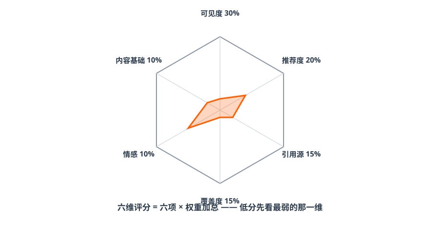

# 第二篇 诊断｜先给品牌打个分

> **一句话总结：不用猜自己行不行——用诊断工具打个分。分数低不是产品差，是 AI 看不见、看不懂、不敢信。**

## 2.1 六维评分模型

用固定问题集在多个 AI 引擎逐条实测，输出六维得分（工具已开源：[skills/S1-diagnosis](https://github.com/cangqiaoGEO/OpenGEO/tree/main/skills/S1-diagnosis)）：

*图解｜六维雷达：六项得分 × 权重加总 = 综合分；低分先看最弱的那一维*

| 维度 | 权重 | 看什么 | 老板白话 |
| --- | --- | --- | --- |
| 可见度 | 30% | 品牌在答案里出现了吗？位置靠前吗？ | 有没有上牌桌 |
| 推荐度 | 20% | AI 是明确推荐你，还是客观带过？ | 是主角还是背景板 |
| 引用源质量 | 15% | AI 引用官网/权威媒体，还是低质聚合站？ | 引的是你家的话吗 |
| 信息覆盖度 | 15% | 价格、地址、资质、案例说得全吗？ | AI 对你了解多深 |
| 情感倾向 | 10% | 描述是正面、中立还是负面？ | 说你好话还是坏话 |
| 内容基础 | 10% | 官网、百科、第三方报道、知识图谱有没有？ | 地基打了没有 |

## 2.2 三份真实报告：差距是可以量化的
- **81 分的小米**：全网信息一致、证据充分——AI 闭着眼推荐；
- **36 分的某餐厅**：公众号内容不错，但没官网、没百科、和三家外地店重名——AI 想推荐都不敢认；
!!! warning "分数生效门槛（先说丑话）"
    **官网 + 认证公众号是两块地基。地基不补齐，后面发再多内容，复测分数也不会动。** 这是所有低分品牌的第一处方，没有例外。

## 2.3 报告怎么读：P0 / P1 / P2

- **P0（1~2 周必做）**：可检索官网、百科词条+品牌消歧——分数生效门槛；
- **P1（1~2 个月）**：权威媒体报道、口碑资产、对比型内容；
- **P2（持续）**：信息维度补齐（价格/资质/FAQ）、月度监测。

## 2.4 自己动手：每周 30 分钟自测法

!!! example "实操：建立你的 20 问题集"
    **品类推荐 10 问**：[城市]+[品类]哪家好 / [品类]怎么选 / [场景]有什么推荐 / [人群]适合的[品类] / [品类]排行榜 / [痛点]怎么解决 / [品类]多少钱 / [品类]避坑指南 / [细分场景]推荐 / 附近的[品类]

    **品牌直达 5 问**：[品牌]怎么样 / [品牌]口碑 / [品牌]地址 / [品牌]价格 / [品牌]和谁合作过

    **对比验证 5 问**：[品牌]和[竞品]哪个好 / [品牌]值得选吗 / [品牌]优势 / [品牌]是正规公司吗 / [品牌]售后怎么样

    每周三固定时间，在豆包/元宝/DeepSeek 各问一遍，每问记录四项：**是否提及｜是否推荐｜引用了谁｜说得对不对**。四周下来，趋势自现。

??? question "章末自测（2 题）"
    1. 六个维度里权重最高的是哪个？为什么它排第一？
    2. 一家企业诊断 36 分，公众号内容很好，但没官网、没百科——它的 P0 是什么？

    ??? success "参考答案"
        1 可见度（30%）——先有出现，才谈推荐、引用、准确；没被看见，后面全是零。2 官网 + 百科词条（品牌消歧）——这是分数生效门槛，地基不补，内容再好复测也不动。

## ✅ 行动检查

- [ ] 领取/生成了自己品牌的基线诊断（哪怕先用 20 问手测）；
- [ ] 找出了最弱的一维，写下了自己的 P0 三件事；
- [ ] 在日历上设了每周三的 30 分钟复测提醒。
