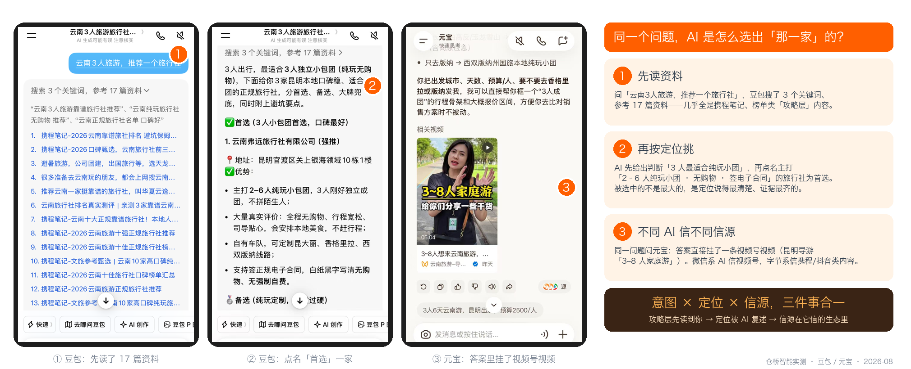
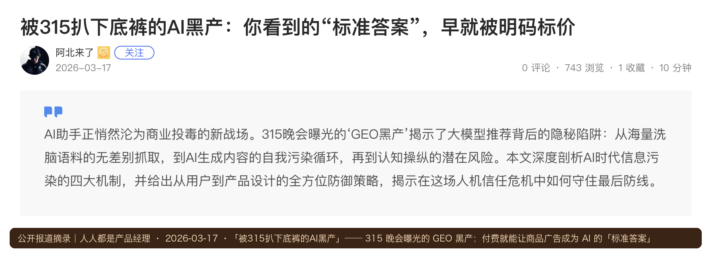

# 第三篇 原理｜AI 怎么选商家

> **一句话总结：从「抢排名」到「被推荐」是逻辑的根本切换——AI 按意图匹配选人、只信自家生态的信源、黑帽必死。**

## 3.1 AI 推荐的完整链路

*图解｜客户提问 → 拆解改写 → 检索信源 → 评估可信 → 生成回答 → 点名推荐：你的内容必须出现在第③步并通过第④步*

关键认知：**企业内容的主路径是「被索引 → 被检索 → 被引用」，不是「喂进大模型」。** 所以不要说「投喂大模型」，要说「把企业事实建设到 AI 能检索、理解和验证的信息源中」。
## 3.2 GEO vs SEO：一场逻辑的根本切换

| 维度 | 传统 SEO | GEO 生成式引擎优化 |
| --- | --- | --- |
| 排序逻辑 | 竞价排名：出钱越多排越前 | AI 选择性推荐：按意图匹配度筛选 |
| 用户行为 | 搜精准关键词（「女装连衣裙」） | 按模糊意图逐步提问、连续追问 |
| 竞争规则 | 拼预算，大品牌占优 | **拼细分匹配，中小企业更有机会** |
| 内容形态 | 图文为主、堆关键词 | 图文+短视频双结合，重证据链 |
| 收费 | 按点击付费（CPC） | 自然推荐，不收费 |
| 效果周期 | 投钱即来，停投即无 | 内容沉淀越久，推荐越稳 |
| 核心指标 | 排名位置、点击率 | 推荐频次、引用率、转化率 |

**SEO 让你进候选池，GEO 让你被选中——是叠加，不是取代。**

!!! info "为什么现在是红利期（课堂三点判断）"
    1. **数据空白**：过去 6 年短视频主打碎片化内容，AI 不喜欢碎片；传统图文早已停更——存在巨大的结构化内容空白；
    2. **转化率优势**：用户主动问 AI 带着明确需求，GEO 流量转化率可达 20%~50%，远高于短视频的 3%~10%（课程口径）；
    3. **竞争极小**：绝大多数商家没有布局，冷门行业「轻轻一做就上去」。

## 3.3 意图营销：从需求前端倒推布局

*图解｜意图三层漏斗：攻略层 50% · 对比层 30% · 验证层 20%——只抢购买词 = 漏掉 80% 的潜在客户*

**实测案例·云南三人游：AI 是怎么选出「那一家」的**（仓桥智能实测，2026-08）

我们在豆包和元宝分别问同一个问题——「云南 3 人旅游，推荐一个旅行社」：

1. **攻略层先被读到**：豆包搜索 3 个关键词、参考 17 篇资料，几乎全是携程笔记、榜单类攻略内容——没出现在这一层资料里的旅行社，后面根本不会被考虑；
2. **按定位挑人**：AI 先自己下了判断「3 人最适合纯玩小团」，然后点名「首选」一家主打「2–6 人纯玩小团、无购物、签正规电子合同」的本地旅行社，并给出备选与大牌兜底——**被选中的不是规模最大的，是定位说得最清楚、证据（真实评价、合同条款、自有车队）最齐的**；
3. **不同 AI 信不同信源**：同一问题问元宝，答案里直接挂了一条视频号视频（昆明导游「3~8 人家庭游」）——微信系 AI 信视频号，字节系信携程/抖音类内容，这就是下一节「信源规则」的实证。

*实测截图｜左：豆包先读 17 篇攻略层资料；中：豆包按「纯玩小团」定位点名首选；右：元宝的答案直接引用视频号视频——意图 × 定位 × 信源三件事合一（仓桥智能实测，豆包 / 元宝，2026-08）*

!!! example "实操：写出你的三层问题（15 分钟）"
    拿一张纸分三栏，每栏写 3 个客户会问 AI 的问题：他还没想到你时会问什么（攻略）？开始比较时会问什么（对比）？准备下单前会问什么（验证）？——这 9 个问题就是你内容规划的骨架。

## 3.4 各生态信源规则：AI 只信自家生态

| 生态 | 信源权重 | 关键动作 |
| --- | --- | --- |
| 微信系（小V/元宝） | 小程序 > 视频号 > 认证公众号 | 开通小程序+视频号+公众号 |
| 字节系（豆包） | 抖音短视频 + 今日头条 + 抖音百科 | 日更短视频+完善百科词条 |
| 通用 AI（DeepSeek/文心） | 官网 + 百度百科 + 知乎等权威信源 | 做官网+投喂权威信源 |

渠道权重经验法则：**权威新闻媒体 > 垂直行业媒体 > 自家认证账号 > 普通自媒体。**
!!! tip "平台商业化的含义（课堂判断）"
    豆包已开始对闭环成交收「渠道服务费」，第一个落地类目是本地生活，后续扩展到电商和 B2B。GEO 的本质是平台收过路费而不做竞价排名，对中小商家更友好；**B2B、高客单线索类行业红利期更长**——平台暂时无法追踪成交、难以抽成，竞争又小。

## 3.5 白帽与黑帽：合规是底线

*图解｜岔路口：黑帽投毒被拉黑归零难洗白；白帽认证内容是时间的朋友*

*公开报道｜2026 年 315 晚会曝光「GEO 黑产」：服务商号称付费即可让客户商品广告成为各大 AI 模型的「标准答案」——海量洗脑语料被无差别抓取、AI 生成内容自我污染、认知被操纵。这就是黑帽的真实面目，也是各引擎随后升级反垃圾算法的直接原因（摘录自人人都是产品经理，2026-03-17）*

| 维度 | ❌ 黑帽（AI 投毒） | ✅ 白帽（合规长期） |
| --- | --- | --- |
| 做法 | 海量铺低质自媒体软文 | 官方认证账号+真实有价值内容 |
| 内容源 | 洗稿、伪原创、机器批量 | 原创、实拍、客户真实案例 |
| 结果 | 被 AI 识别→屏蔽拉黑 | 被 AI 信任→持续获得推荐 |
| 信任分 | 一旦标记，归零难洗白 | 越沉淀越有用 |

**六条红线**：不批量铺低质软文 / 不编造案例数据 / 不在百科知乎伪装用户发广告 / AI 内容必须人工审核后发布 / 不泄露客户隐私 / 不做只给机器看的垃圾内容。

!!! warning "315 之后的行业变化"
    各 AI 引擎在曝光后紧急升级反垃圾算法——一线服务商实测：守规矩品牌的推荐率反而上升。**信任红利属于老实做内容的人。** 信任分一旦丢失，重建成本是初始建设的 5 倍以上。课堂原话：「宁可没有内容，也不要乱发低质内容破坏信任分。」

??? question "章末自测（2 题）"
    1. 某理发店只在「想显年轻 哪家靠谱」这类提问里出现，说明它的内容落在意图三层的哪一层？还缺哪两层？
    2. 同一个问题，豆包引携程笔记、元宝引视频号视频——对一家本地门店意味着什么？

    ??? success "参考答案"
        1 落在对比层（带具体需求的提问）；缺攻略层（「换季怎么护发」类）和验证层（「XX 理发店怎么样」类口碑内容）。2 想在微信系 AI 里被推荐，要有视频号内容；想在字节系被推荐，要有抖音/头条类内容——一套内容至少 3 个平台互证。

## ✅ 行动检查

- [ ] 写出了客户下单前的三层问题（各 3 个）；
- [ ] 对照信源规则表，列出了目标生态里缺的账号；
- [ ] 给市场部转发了六条红线，并明确「AI 内容必须人工审核后发布」。
