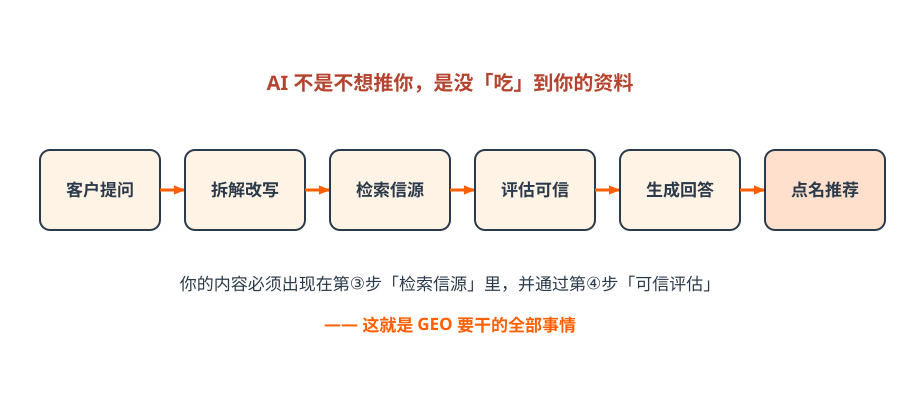
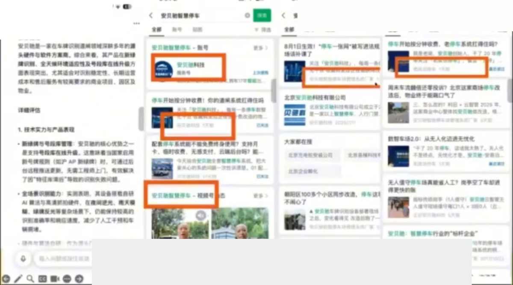
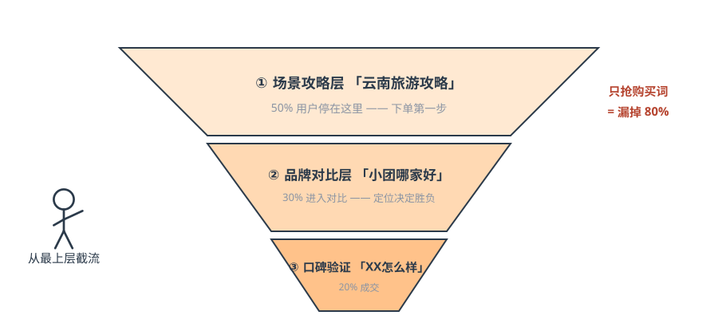
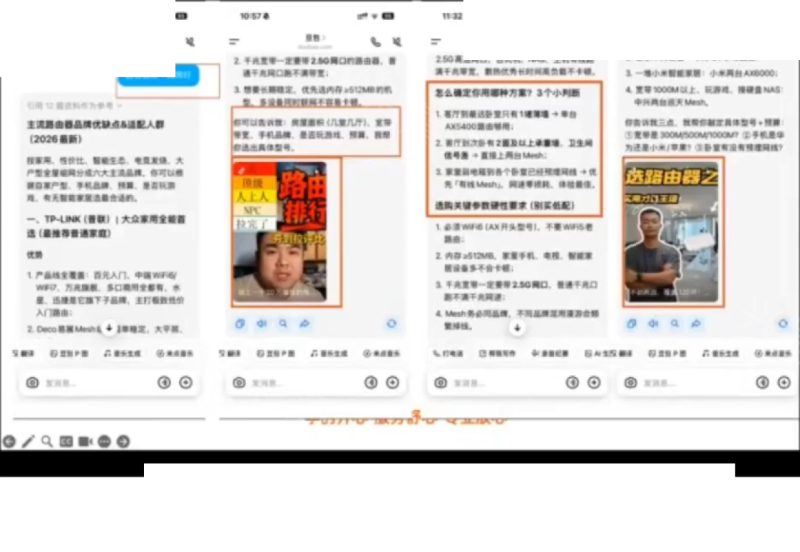
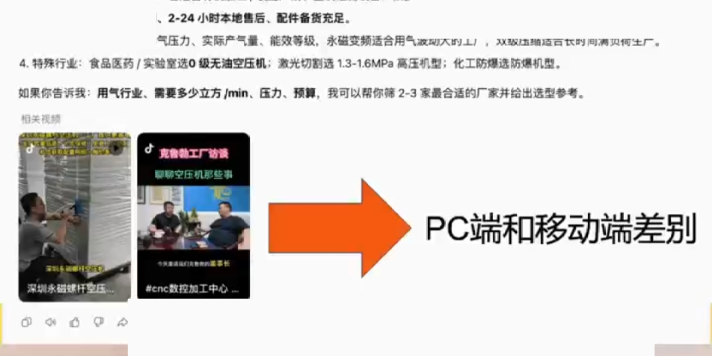
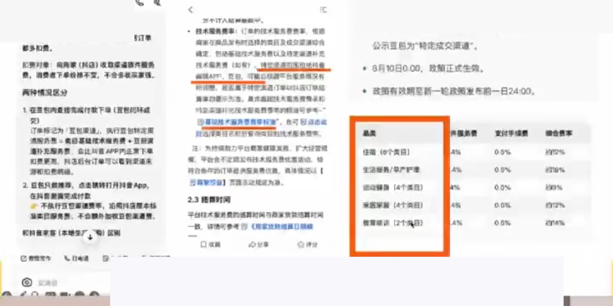
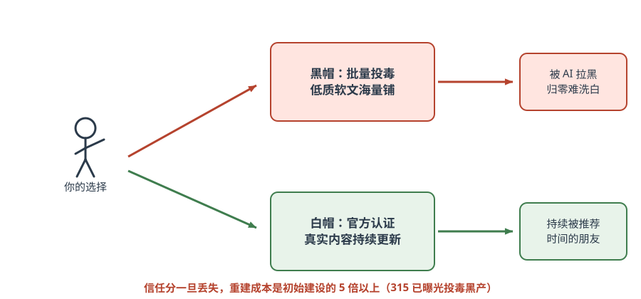
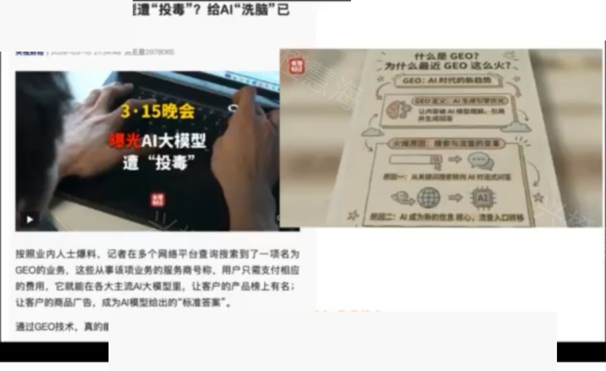

# 第三篇 原理｜AI 怎么选商家

> **一句话总结：从「抢排名」到「被推荐」是逻辑的根本切换——AI 按意图匹配选人、只信自家生态的信源、黑帽必死。**

## 3.1 AI 推荐的完整链路

*图解｜客户提问 → 拆解改写 → 检索信源 → 评估可信 → 生成回答 → 点名推荐：你的内容必须出现在第③步并通过第④步*

关键认知：**企业内容的主路径是「被索引 → 被检索 → 被引用」，不是「喂进大模型」。** 所以不要说「投喂大模型」，要说「把企业事实建设到 AI 能检索、理解和验证的信息源中」。

*课件截图｜AI 回答里直接引用并推荐了企业公众号文章——公众号在 AI 时代「起死回生」，核心价值是作为 AI 可抓取的信源（来源：许茹冰GEO直播课课件截图，2026-08，仅作教学案例引用，版权归原作者）*

## 3.2 GEO vs SEO：一场逻辑的根本切换

| 维度 | 传统 SEO | GEO 生成式引擎优化 |
| --- | --- | --- |
| 排序逻辑 | 竞价排名：出钱越多排越前 | AI 选择性推荐：按意图匹配度筛选 |
| 用户行为 | 搜精准关键词（「女装连衣裙」） | 按模糊意图逐步提问、连续追问 |
| 竞争规则 | 拼预算，大品牌占优 | **拼细分匹配，中小企业更有机会** |
| 内容形态 | 图文为主、堆关键词 | 图文+短视频双结合，重证据链 |
| 收费 | 按点击付费（CPC） | 自然推荐，不收费 |
| 效果周期 | 投钱即来，停投即无 | 内容沉淀越久，推荐越稳 |
| 核心指标 | 排名位置、点击率 | 推荐频次、引用率、转化率 |

**SEO 让你进候选池，GEO 让你被选中——是叠加，不是取代。**

!!! info "为什么现在是红利期（课堂三点判断）"
    1. **数据空白**：过去 6 年短视频主打碎片化内容，AI 不喜欢碎片；传统图文早已停更——存在巨大的结构化内容空白；
    2. **转化率优势**：用户主动问 AI 带着明确需求，GEO 流量转化率可达 20%~50%，远高于短视频的 3%~10%（课程口径）；
    3. **竞争极小**：绝大多数商家没有布局，冷门行业「轻轻一做就上去」。

## 3.3 意图营销：从需求前端倒推布局

*图解｜意图三层漏斗：攻略层 50% · 对比层 30% · 验证层 20%——只抢购买词 = 漏掉 80% 的潜在客户*

真实案例·云南九游旅游「纯玩小团」（据操盘方分享）：

1. **第一层意图**：用户想去云南，先问 AI「云南旅游景点推荐」——AI 优先推荐视频号攻略内容，用户点进商家主页；
2. **第二层意图**：看完攻略想要小团定制，问「云南小团旅游哪家好」——AI 按定位差异化推荐：九游主打「个性化定制 + 坚决拒绝购物」，精准命中痛点；
3. **第三层意图**：用户验证，问「九游旅行社怎么样」——AI 抓取最新官方内容，输出「运营规范、高品质纯玩、直营透明」，并直接推荐官方公众号，跳转咨询完成闭环。

*课件截图｜AI 回答云南旅游攻略类问题时的推荐结果——攻略层是客户决策的第一步，也是截流的最前端（来源：许茹冰GEO直播课课件截图，2026-08，仅作教学案例引用，版权归原作者）*

结果：两年累计利润 4000 万，AI 推荐位常驻前三。

!!! example "实操：写出你的三层问题（15 分钟）"
    拿一张纸分三栏，每栏写 3 个客户会问 AI 的问题：他还没想到你时会问什么（攻略）？开始比较时会问什么（对比）？准备下单前会问什么（验证）？——这 9 个问题就是你内容规划的骨架。

## 3.4 各生态信源规则：AI 只信自家生态

| 生态 | 信源权重 | 关键动作 |
| --- | --- | --- |
| 微信系（小V/元宝） | 小程序 > 视频号 > 认证公众号 | 开通小程序+视频号+公众号 |
| 字节系（豆包） | 抖音短视频 + 今日头条 + 抖音百科 | 日更短视频+完善百科词条 |
| 通用 AI（DeepSeek/文心） | 官网 + 百度百科 + 知乎等权威信源 | 做官网+投喂权威信源 |

渠道权重经验法则：**权威新闻媒体 > 垂直行业媒体 > 自家认证账号 > 普通自媒体。**

*课件截图｜AI 回答「食品机械源头厂家」类问题：推荐了具体厂家并附上参数、优势与实拍视频——冷门制造业 To B 是当前 GEO 真空区（来源：许茹冰GEO直播课课件截图，2026-08，仅作教学案例引用，版权归原作者）*

*课件截图｜豆包本地生活 2026 年 7 月起的平台规则：AI 推荐完成后跳转抖音团购闭环并收取渠道服务费（餐饮/酒店/休闲各档费率）——平台商业化从本地生活先落地（来源：许茹冰GEO直播课课件截图，2026-08，仅作教学案例引用，版权归原作者）*

!!! tip "平台商业化的含义（课堂判断）"
    豆包已开始对闭环成交收「渠道服务费」，第一个落地类目是本地生活，后续扩展到电商和 B2B。GEO 的本质是平台收过路费而不做竞价排名，对中小商家更友好；**B2B、高客单线索类行业红利期更长**——平台暂时无法追踪成交、难以抽成，竞争又小。

## 3.5 白帽与黑帽：合规是底线

*图解｜岔路口：黑帽投毒被拉黑归零难洗白；白帽认证内容是时间的朋友*

*课件截图｜315 晚会曝光「AI 大模型遭投毒」黑产——海量铺低质软文干扰 AI 结果的玩法已被点名，各引擎随后升级反垃圾算法（来源：许茹冰GEO直播课课件截图，2026-08，仅作教学案例引用，版权归原作者）*

| 维度 | ❌ 黑帽（AI 投毒） | ✅ 白帽（合规长期） |
| --- | --- | --- |
| 做法 | 海量铺低质自媒体软文 | 官方认证账号+真实有价值内容 |
| 内容源 | 洗稿、伪原创、机器批量 | 原创、实拍、客户真实案例 |
| 结果 | 被 AI 识别→屏蔽拉黑 | 被 AI 信任→持续获得推荐 |
| 信任分 | 一旦标记，归零难洗白 | 越沉淀越有用 |

**六条红线**：不批量铺低质软文 / 不编造案例数据 / 不在百科知乎伪装用户发广告 / AI 内容必须人工审核后发布 / 不泄露客户隐私 / 不做只给机器看的垃圾内容。

!!! warning "315 之后的行业变化"
    各 AI 引擎在曝光后紧急升级反垃圾算法——一线服务商实测：守规矩品牌的推荐率反而上升。**信任红利属于老实做内容的人。** 信任分一旦丢失，重建成本是初始建设的 5 倍以上。课堂原话：「宁可没有内容，也不要乱发低质内容破坏信任分。」

## ✅ 行动检查

- [ ] 写出了客户下单前的三层问题（各 3 个）；
- [ ] 对照信源规则表，列出了目标生态里缺的账号；
- [ ] 给市场部转发了六条红线，并明确「AI 内容必须人工审核后发布」。
