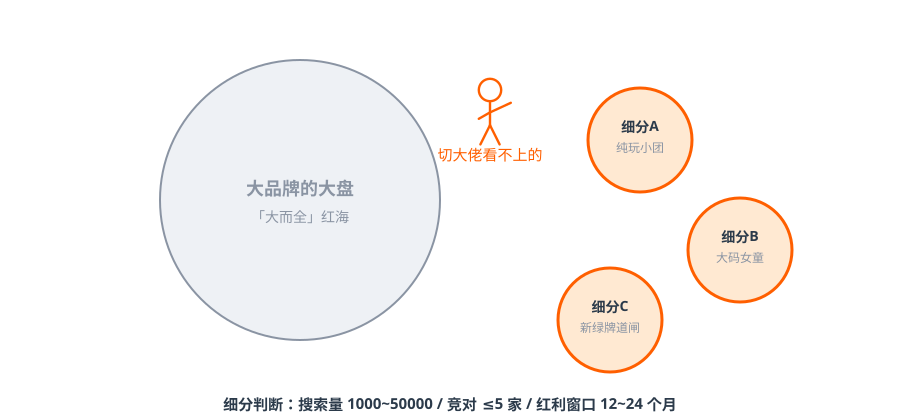
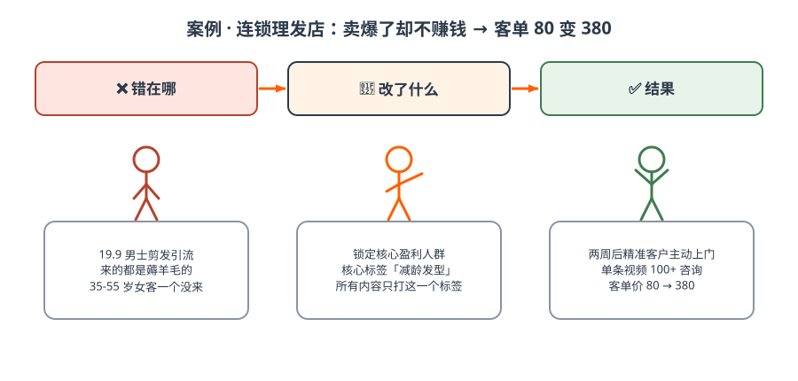
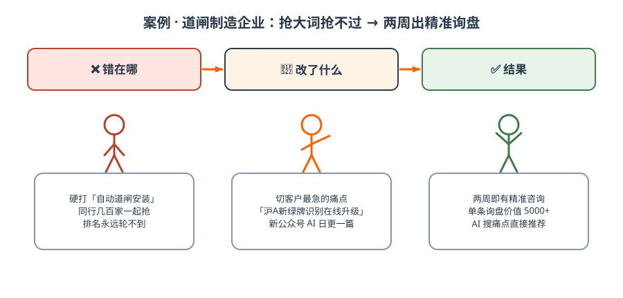

# 第四篇 战略｜定位标签化，抢细分生态位

> **一句话总结：信源、结构这些「技术流」其实很简单——真正难的是：AI 推荐多家时，用户凭什么选你？定位是胜负手。**

## 4.1 定位先行，内容后置

- 错位 = 同质化 = 价格战 = 利润归零；
- 定位必须与用户痛点深度绑定，并和大盘差异化；
- **小狗战略**：不跟大品牌抢「大而全」，切大佬看不上、覆盖不到的细分需求。

*图解｜小狗战略：大品牌守大盘红海，你钻细分蓝海——纯玩小团 / 大码女童 / 新绿牌道闸*

!!! tip "细分判断三标准"
    目标词搜索量 **1000~50000** / 竞争对手 **≤5 家** / 红利窗口通常 **12~24 个月**，必须先占位。细分本质：把一个「小而痛」的需求做到「唯一解」。越细分、越冷门刚需，AI 推荐命中率越高。

## 4.2 标签化三步法：让内容有「唯一记号」

| 步骤 | 方法 | 案例 |
| --- | --- | --- |
| STEP 1 梳理标签 | 画 5 个核心客户画像，罗列他们最痛的 3 个问题，从**核心盈利人群**的核心痛点提炼 | 女装 =「显瘦」「好看不撞款」 |
| STEP 2 差异化 | 列出 TOP5 竞品标签，圈出你「能做但别人不愿做」的那一个 | 养发 =「防脱生发」，避开「白发」 |
| STEP 3 聚焦生产 | 所有内容围绕这一个标签持续生产、全网统一 | 餐饮 =「现炒」「明档厨房」 |

**标签不必复杂**：越简单、越精准、越能记住。标签 = 认知——你的所有内容都在告诉 AI「你等于什么」。

### 行业差异化口诀（课堂总结）

| 行业 | 客户最关心 | 内容怎么做 |
| --- | --- | --- |
| 生产制造 / To B | 「**源头厂家，技术扛打**」 | 反复展示源头工厂身份，用数字体现技术（9 分钟出餐 24 份、一台机器顶 10 个人） |
| 本地同城实体 | 「**踏实靠谱，良心生意**」 | 不博眼球，展示门店、产品，老板出镜体现靠谱——本质是熟人生意 |
| 招商加盟 | 「**趋势风口 + 轻松赚钱**」 | 老板专家号讲趋势吸引代理，产品号获取 C 端客户 |
| 高端高客单定制 | 「**细节可视化**」 | 把工艺、细节、质感拍出来让客户自己判断，越直接越有效 |

!!! example "实操：一小时定出核心标签"
    1. 拉上销售负责人，回答：「过去一年利润最高的 20 个客户是谁？他们当初为什么选我们？」（15 分钟）
    2. 把答案浓缩成 3 个候选标签，每个不超过 8 个字（15 分钟）
    3. 逐个检验：搜索量 1000~50000？竞对 ≤5 家？我们真做得到「唯一解」？（20 分钟）
    4. 老板拍板一个——**从此全公司只打这一个标签**（10 分钟）

## 4.3 两个真实案例：标签改对了，生意就通了

*图解｜连锁理发店：卖爆了却不赚钱 → 锁定盈利人群打「减龄」标签 → 客单 80 变 380*

**案例 A 连锁理发店：从「19.9 男士剪发」到「减龄」**（据操盘方分享）

- 原打法：找代运营做低价引流爆款，卖爆却不赚钱——核心盈利人群（35–55 岁女性）错位，无法升单；
- 新标签：锁定「怕变老、想年轻」痛点，核心标签「减龄」；
- 新动作：所有短视频、公众号内容围绕「减龄发型」生产，全部打上话题标签 + 团购套餐绑定；
- 结果：两周后大量精准客户主动咨询，单条视频带来 100+ 咨询，**客单价从 80 提升到 380**。

*图解｜道闸厂：大词抢不过 → 切痛点词 → 两周出询盘*

**案例 B 道闸制造企业：从大词到痛点词**（据操盘方分享）

- 原打法：抢大词「自动道闸安装」，无差异化抢不到流量；
- 新标签：聚焦行业痛点「支持沪A新绿牌照段在线升级」——上海新绿牌识别不出是物业与车主最急的问题；
- 新动作：注册新公众号，AI 自动化生产，**7 月 25 日发出第一篇文章，一天一篇**，不需要人工写稿；
- 结果：两周即有精准客户咨询，单条询盘价值 5000+；现场用 AI 搜「沪AP新绿牌道闸不认怎么办」直接推荐了这家企业。
两案例共同点：**放弃「大词」、聚焦「痛点词」、所有内容标签化、矩阵化生产。** 课堂另一判断：品牌方有内容限制（如医疗、金融）的，做公众号 GEO 比做短视频限制更少、更容易起。

!!! warning "最常见的翻车：人群错位"
    理发店案例的本质教训不是标签技巧，而是**内容拍给了不赚钱的人群看**。先问「谁给我贡献利润」，再问「他们怕什么」，最后才轮到「内容怎么做」。

## ✅ 行动检查

- [ ] 完成了「一小时定标签」实操，老板拍板了一个 ≤8 字的核心标签；
- [ ] 对照行业口诀表，确定了自己的内容表达方式；
- [ ] 通知了所有做内容的人：从今天起全网只打这个标签。
