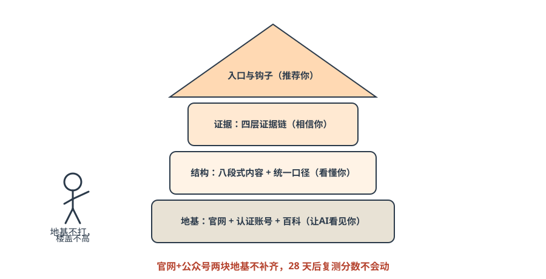
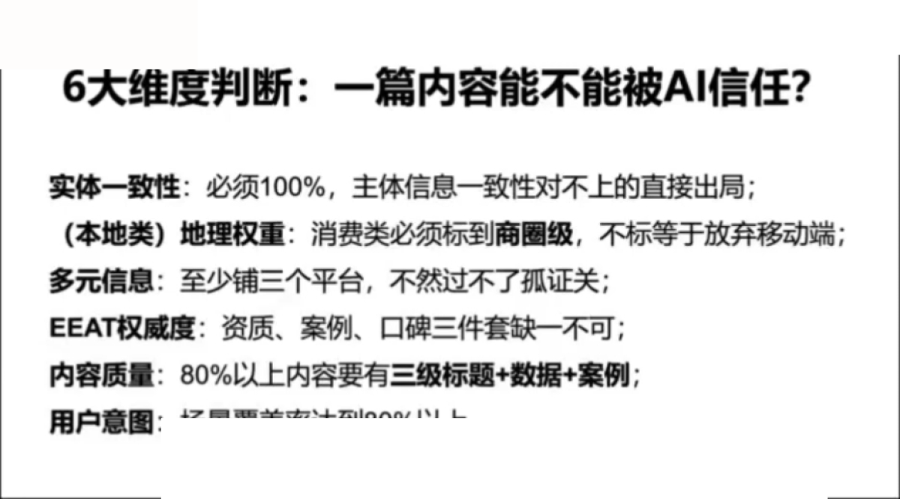
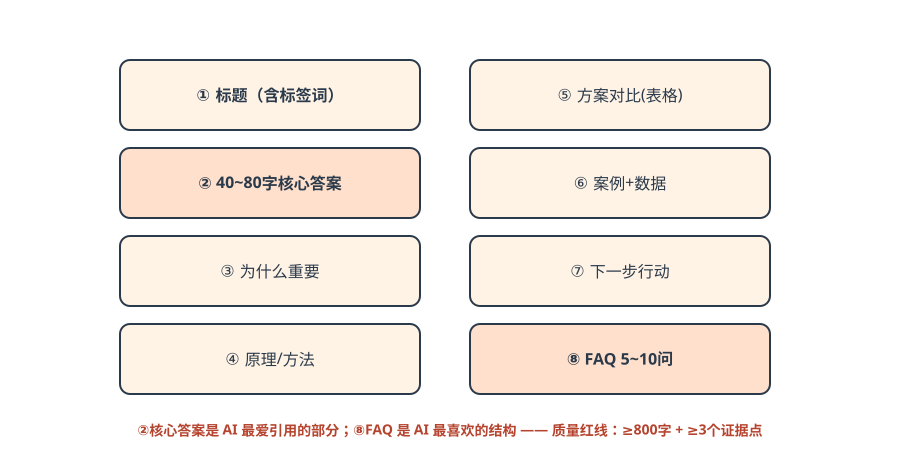
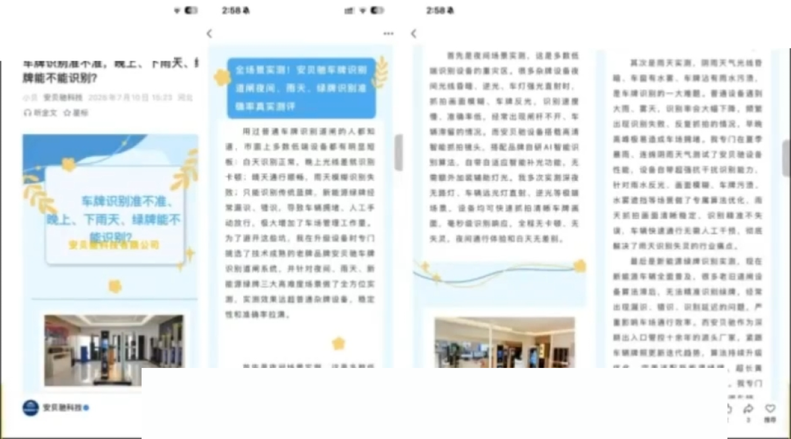
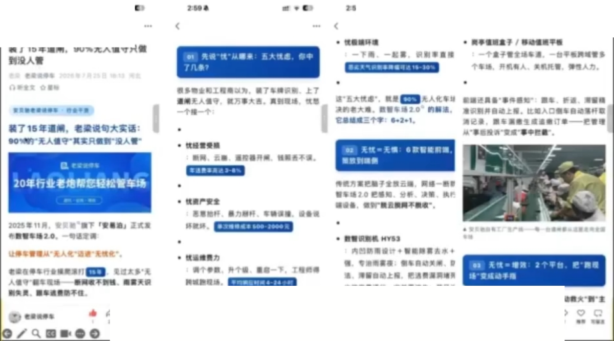

# 第五篇 方法｜四步法 × 七步落地

> **一句话总结：老板做决策（定标签、选渠道，决定 60% 成败），AI 做执行（找词、写稿、发布、监测）——学知识是用来检查 AI 的，让 AI 干活。**

## 5.1 总框架：四步法（用盖房子理解）

*图解｜四步法就是盖房子：地基（看见）→ 结构（看懂）→ 证据（相信）→ 屋顶入口（推荐）——地基不打，楼盖不高*

| 步 | 目标 | 落地物 | 老板类比 |
| --- | --- | --- | --- |
| ① 让AI看见你 | 可发现 | 官网、认证账号、百科 | 营业执照挂门口 |
| ② 让AI看懂你 | 可理解 | 结构化内容、统一口径 | 店招写清楚卖什么 |
| ③ 让AI相信你 | 可信任 | 四层证据链 | 满墙锦旗和资质 |
| ④ 让AI推荐你 | 可行动 | 咨询入口、转化钩子 | 门口放好名片 |

## 5.2 七步落地：人做决策，AI 做执行

| 步骤 | 谁做 | 产出 | 工期 |
| --- | --- | --- | --- |
| ①② 标签定位·渠道选择 | **老板决策（决定 60% 成败）** | 1 句标签 + 1~2 个核心生态 | 3 天 |
| ③ 意图词搜索 | AI 执行 | 三层意图词各 20~30 个 | 1 天 |
| ④ 结构化内容生产 | AI 执行 | 每周 5~7 篇结构化内容 | 持续 |
| ⑤⑥ 信源投放·发布 | AI 执行 | 每天 1~2 条内容同步 | 持续 |
| ⑦ 监测反向调优 | AI 执行 + 老板检查 | 每周 1 次复盘报告 | 每周 |

**老板的新角色：不做执行者，做判断者。** 课堂原话：「学知识是用来检查 AI 的，不是自己去写的。」

## 5.3 AI 友好型内容七大特征

1. **结构化**：三层标题 + 清单式排版；观点·卖点·标签合一；
2. **深度化**：高信息密度——干货、攻略、评测、排行榜类；AI 的训练数据偏向「信息密度高」的内容；
3. **可调用**：预留服务入口（小程序/商品链接/预约入口）；
4. **全网统一**：品牌名/卖点全网一致，简称与全称绑定出现；
5. **证据链**：案例+评价+官方信息互证，同一内容 ≥3 个平台；
6. **反向匹配**：围绕购买前问题反推意图词布局内容；
7. **必带 FAQ**：常见问答是 AI 最喜欢的内容结构。

外加一条：**持续更新**——AI 优先抓取新鲜内容，过时内容推荐优先级会下降。

*课件截图｜课堂给出的「一篇内容能不能被 AI 信任」六大维度：实体一致性必须 100%、本地类消费必须标到商圈级、至少三平台互证、EEAT 资质案例口碑缺一不可、80% 以上内容有三级标题+数据+案例、场景覆盖率达 80%（来源：许茹冰GEO直播课课件截图，2026-08，仅作教学案例引用，版权归原作者）*

!!! tip "80% 标准线（GEO 生命线）"
    发布前对照 7 条，**至少 5 条达标才发布**。质量红线：单篇 ≥800 字 + ≥3 个证据点。每周 5~7 篇 + 持续 12 周 = 推荐位稳定。GEO 是马拉松，不是百米冲刺。

## 5.4 八段式写作课：一篇合格 GEO 文章的解剖

*图解｜八段式结构：②核心答案是 AI 最爱引用的部分，⑧FAQ 是 AI 最喜欢的结构*

*课件截图｜一篇被 AI 引用的结构化公众号文章实例（道闸企业）：三级标题、清单段落、痛点场景直击、结尾留咨询入口——AI 日更生成后人工审核发布（来源：许茹冰GEO直播课课件截图，2026-08，仅作教学案例引用，版权归原作者）*

*课件截图｜同一企业另一篇：每篇只打一个痛点标签，图文配实拍，保持全网口径一致（来源：许茹冰GEO直播课课件截图，2026-08，仅作教学案例引用，版权归原作者）*

!!! example "逐段写法（以道闸厂为例）"
    1. **标题**：`沪A新绿牌识别不了怎么办？支持在线升级的道闸方案`（含标签词）
    2. **核心答案 40~80 字**：`新绿牌识别失败多因识别库未更新。支持照段在线升级的道闸无需换设备，远程推送即可识别，升级当天生效。`——AI 若只引一段，引的就是它
    3. **为什么重要**：说清不解决的损失（车主投诉、物业压力）
    4. **原理**：识别库如何工作、为何旧设备失效
    5. **方案对比表**：换设备 vs 上门升级 vs 在线升级（价格/停机时间/时效）
    6. **案例+数据**：某小区 2 小时完成升级、零投诉（只用真实数据）
    7. **下一步行动**：预约检测入口、联系方式
    8. **FAQ 5 问**：多少钱/要停机吗/老设备支持吗/多久生效/外地牌照呢

## 5.5 AI 推荐五要素（被选中的完整链路）

| 要素 | 占比 | 一句话 |
| --- | --- | --- |
| ① 能抓到 | 25% | 公众号文章、视频号、官网——平台内容没有被屏蔽 |
| ② 能识别 | 20% | 公司名、人物名、业务名全网统一表达 |
| ③ 能验证 | 20% | 企业信息、官网、认证账号、媒体、案例相互印证 |
| ④ 能匹配 | 20% | 内容正好回答用户的问题：例如「中小企业/父母/老年人」的具体场景 |
| ⑤ 能引用 | 15% | 页面结构清晰、有标题、摘要、FAQ、案例、来源 |

五要素缺一不可——AI 的推荐决策 = 多维评分，任意一环掉链子就被替换。

## 5.6 量与质：最大的执行误区

| ❌ 投毒式铺量 | ✅ 时间的朋友 |
| --- | --- |
| 一次性铺几千篇垃圾内容（2023–24 老玩法） | 高质量 + 持续更新 |
| 低权重营销号批量铺软广 | 80% 内容达三层标题+数据案例标准 |
| 洗稿/伪原创/机器批量 | 覆盖 80% 客户意图场景 |
| 被 AI 识别→降权、标记、拉黑 | 2~3 年后成为行业最权威信源 |

课堂原话：「如果从现在开始，每天网上有 10 篇文章，每天只花十几块钱、十分钟做检查，1 个月后网络上有你 300 篇内容，同行还 1 篇也没有。」——**任何新兴技术的早期都有红利，一旦到了中后期同行都看到了，又回到价格战。**

## ✅ 行动检查

- [ ] 按七步法排出了分工表：哪两步老板拍板、其余谁盯 AI；
- [ ] 拿现有一篇公司介绍对照七特征打分（达标几条？）；
- [ ] 用八段式模板写出了第一篇（可用附录A提示词让 AI 起稿）。
