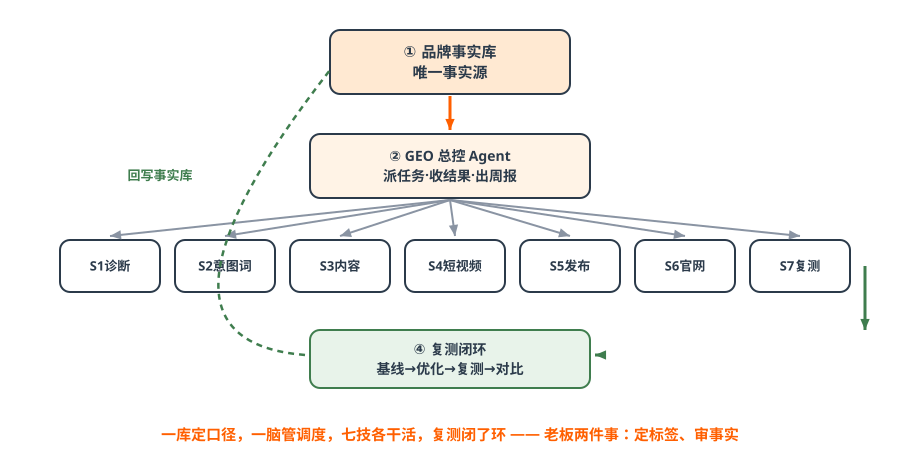
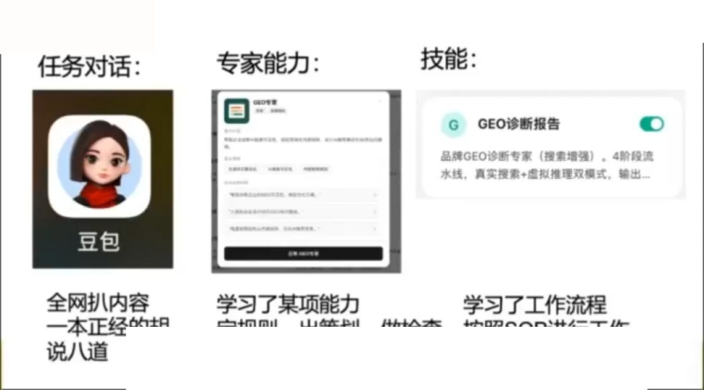
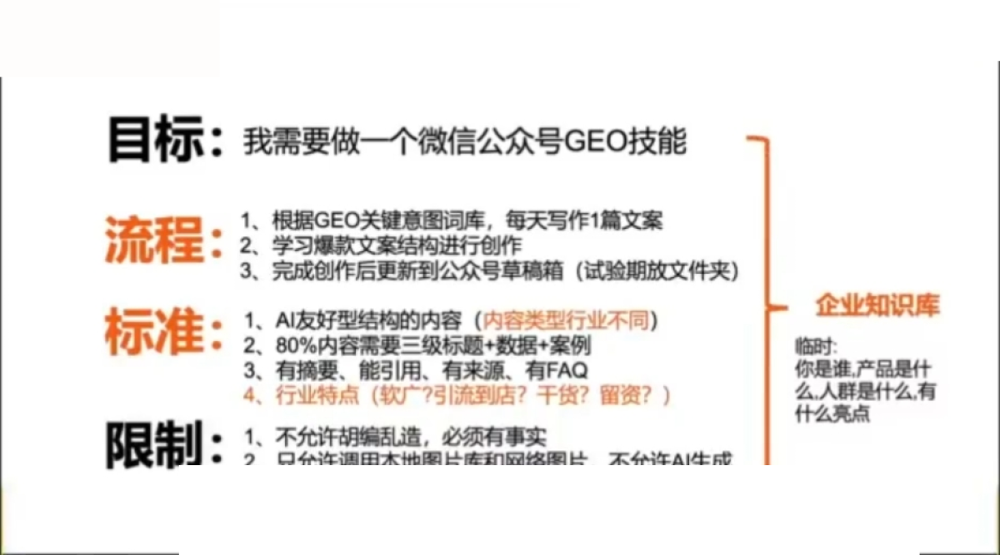
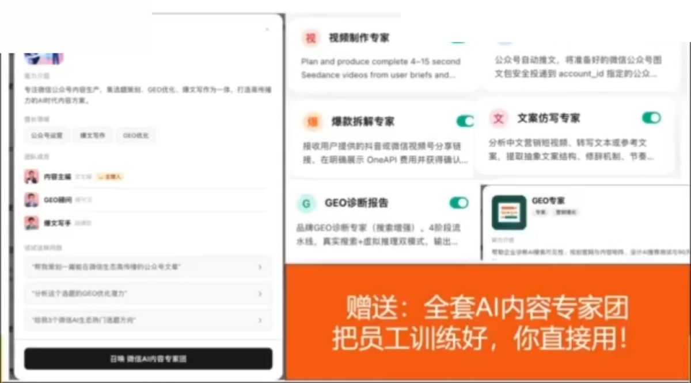
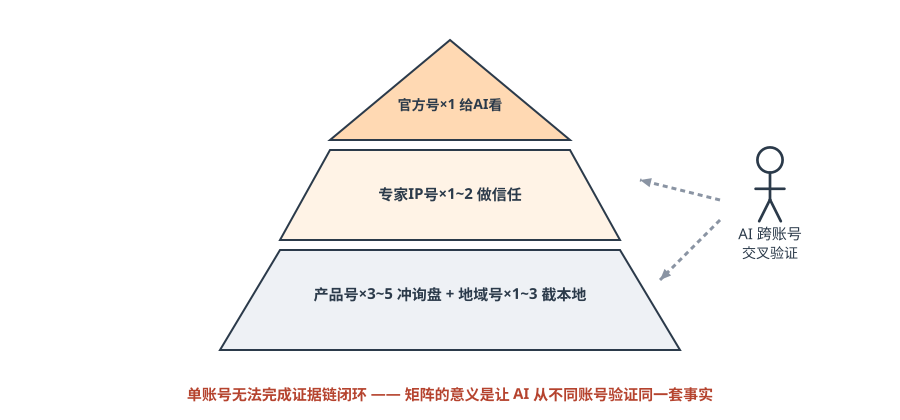
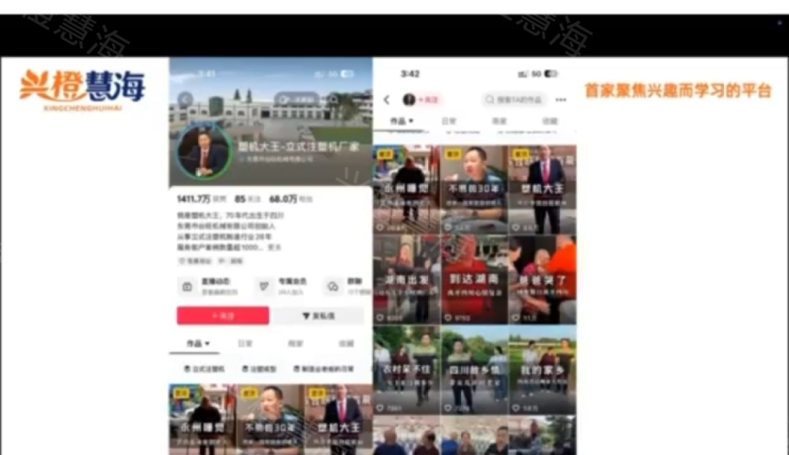
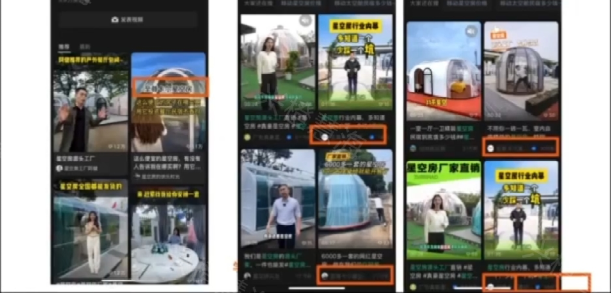
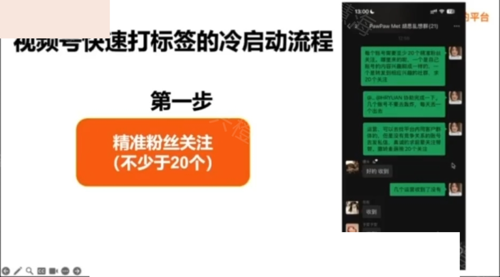
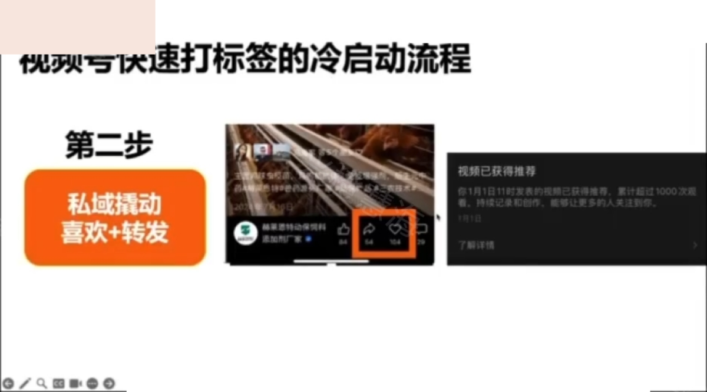

# 第六篇 执行｜作战系统与 AI 员工

> **一句话总结：不买软件、不写代码，训练 AI 员工替你日更内容；再用四类账号组合拳，把有效内容重复一万遍——整套系统已开源。**

## 6.1 仓桥 GEO 作战系统：本篇总框架

*图解｜一库一脑七技一环：品牌事实库定口径，总控 Agent 管调度，七个 Skill 各干活，复测闭环验效果*

!!! tip "口诀与区别"
    **一库定口径，一脑管调度，七技各干活，复测闭了环——老板两件事：定标签、审事实。**

    与市面 GEO Agent 的区别一句话：**别人的 Agent 止于「生成方案」，这套系统闭环到「复测分数」。** 七技提示词规格全部开源：[skills/](https://github.com/cangqiaoGEO/OpenGEO/tree/main/skills)；参考实现 Tencent WorkBuddy（半天搭好）：[实现方案](https://github.com/cangqiaoGEO/OpenGEO/blob/main/system/workbuddy-implementation.md)。

## 6.2 通用大模型 vs AI 超级员工（Agent）

| 维度 | 通用大模型（豆包/DeepSeek…） | AI Agent（超级员工） |
| --- | --- | --- |
| 角色 | 只给建议的「顾问」 | 自主干活的「数字员工」 |
| 交付 | 帮你写一段文字 | 定主题→写稿→排版→配图→定时发布 |
| 人工 | 后续每一步都要人操作 | 全流程自动，老板只下指令 |
| 成本 | 按次问答 | 大平台 Agent 月费约百元级 |
| 学习能力 | 通用知识 | 可投喂企业专属知识库 |

*课件截图｜WorkBuddy 的三个核心模块：任务（对话下达）、专家（预训练的专业能力：出方案、做检查）、技能（实际干活的 AI 员工：按 SOP 执行）——课堂把「全网扒内容一本正经胡说八道」的通用模型与「学了工作流程按 SOP 进行」的技能做了对比（来源：许茹冰GEO直播课课件截图，2026-08，仅作教学案例引用，版权归原作者）*

推荐用大平台官方 Agent 工具（如腾讯 WorkBuddy）：无需代码、自然语言驱动、成本公开透明。**不要买第三方小机构出售的 Agent。**

## 6.3 训练 AI 超级员工五步法

| 步骤 | 要点 | 示例指令 | 工期 |
| --- | --- | --- | --- |
| ① 明需求 | 说清需求、场景与目标结果 | 「做一个养发行业的公众号 GEO 写作技能」 | 0.5 天 |
| ② 给流程 | 交代工作 SOP | 「根据 GEO 关键词每天写一篇→按爆款结构创作→输出到本地文件夹」 | 0.5 天 |
| ③ 定标准 | 行业化质量标准 | 制造业要干货/大健康要场景/餐饮要钩子；必须三层标题+数据案例+FAQ | 0.5 天 |
| ④ 立红线 | 什么不能做 | 不准编造、不准 AI 生图（用本地实拍）、按行业规则过滤敏感词 | 0.5 天 |
| ⑤ 喂知识 | 投喂企业知识库 | 产品、案例、核心信息投喂后反复调试 2~3 次上岗 | 1 天 |

*课件截图｜课堂给出的一份完整训练示例：目标（做微信公众号 GEO 技能）→ 流程（按关键词每天写一篇、按爆款结构、输出到草稿箱）→ 标准（AI 友好结构、80% 内容三级标题+数据+案例、有摘要有 FAQ）→ 限制（不允许胡编乱造、只用本地图片、按行业敏感词处理）+ 企业知识库（来源：许茹冰GEO直播课课件截图，2026-08，仅作教学案例引用，版权归原作者）*

训练完成后可设定时任务：每天自动创作、自动同步公众号草稿箱。**红线不动摇：AI 内容必须人工审核后发布。**

*课件截图｜训练好的「AI 内容专家团」界面：视频制作专家、公众号自动发布、爆款拆解专家、文案仿写专家、GEO 诊断报告、GEO 专家——即作战系统「七技」在 WorkBuddy 上的对应形态（来源：许茹冰GEO直播课课件截图，2026-08，仅作教学案例引用，版权归原作者）*

## 6.4 一本成本账：AI 不是降本，是放大能力

- AI 写一篇 GEO 文章：**2~3 元**（人工 200~300 元 / 3 小时）；
- AI 产一条高质量短视频：**10~12 元**（人工的 1/10 以下）；
- 一人可运营 5~6 个账号——给前台、销售每人配一个 AI 员工，普通员工也能做专业内容；
- 隐性收益：AI 7×24 在线 = 流量永不睡觉；AI 训练数据 = 企业未来 3 年的核心资产。

课堂金句：「给一个普通销售、前台，配上一个 AI 超级员工——人人都是企业的推广员，人人都是 GEO 高手，人人都是短视频高手——这是中小企业一次生产力革命。」

## 6.5 短视频矩阵 3.0：账号组合拳

*图解｜矩阵金字塔：官方号给 AI 看，专家号做信任，产品号+地域号冲询盘——AI 需要跨账号交叉验证*

| 账号类型 | 职责 | 数量 | 更新 | 目标 |
| --- | --- | --- | --- | --- |
| 产品号 | 冲询盘：卖点可视化 | 3~5 个 | 日更 1~2 条 | 3 个月 5 万粉 |
| 专家 IP 号 | 做信任：像「懂行的老中医」 | 1~2 个 | 每周 3~4 条 | 行业话语权 |
| 地域号 | 截本地：只做同城内容 | 1~3 个 | 每周 4~5 条 | 本地搜索霸屏 |
| 官方号 | 做权重：核心是给 AI 看 | 1 个矩阵 | 日更 | AI 抓取核心信源 |

*课件截图｜产品号矩阵的内容形态：实拍为主、卖点可视化（60/70/80 后客群、现场实拍、大字标题）——越简单越好，AI 可批量裂变生产（来源：许茹冰GEO直播课课件截图，2026-08，仅作教学案例引用，版权归原作者）*

*课件截图｜一个专家型 IP 号的主页（14 万粉丝）：讲专业、讲观点、讲案例，不靠人设和情绪——视频号天生偏好专家型 IP（来源：许茹冰GEO直播课课件截图，2026-08，仅作教学案例引用，版权归原作者）*

矩阵 3.0 = 算法推荐（3 秒完播）+ 用户爱看 + AI 抓取（结构化）——**标签为王，替代选题为王**。90% 的中小企业老板不适合做网红 IP，适合做专家型 IP：网红靠人设、故事、情绪；专家靠专业、观点、案例。

!!! note "矩阵的三代进化（课堂复盘）"
    1.0 以量取胜（复用爆款素材批量铺号，平台查重后失效）→ 2.0 分类分散（按 IP、地域、流量类型拆账号，化整为零）→ **3.0 三合一**（算法推荐 + 用户爱看 + AI 抓取）。另一个被低估的用法：**废掉的抖音账号依然可以做 GEO**——算法上标签混乱、流量废掉的账号，完全不影响 AI 抓取，是废号二次利用的最佳方式。

## 6.6 视频号三招（微信生态加餐）

*课件截图｜「标签截流起号法」实例：星空房源头厂家在视频号上的账号矩阵，每条内容统一带「#星空房厂家」等用户高频搜索标签——课堂口径：一个新产品靠此法做到年营收 8000 万（来源：许茹冰GEO直播课课件截图，2026-08，仅作教学案例引用，版权归原作者）*

1. **话题标签抢客法**：去同行爆款视频评论区，找用户高频搜索生成的蓝色话题标签，围绕它连拍 5~6 条带同一标签——用户点标签全是你，AI 也按标签抓；本质与早年淘宝店群、百度站群是同一抢坑位逻辑，视频号独有（抖音话题分散效果差）；
2. **新号冷启动**：视频号首次推流基于社交关系——朋友点红心（点赞）有 **1:5 流量奖励**（收藏无奖励）；先做 20 个基础粉丝 → 红心+转发 → 初始流量破千后平台自动推流；
3. **封面大于标题**：视频号大量流量来自转发，转发后别人第一眼看到的是封面——封面要清晰、大字卖点。

*课件截图｜视频号冷启动第一步：精准粉丝关注（不少于 20 个）——把新账号发到朋友群请熟人关注（来源：许茹冰GEO直播课课件截图，2026-08，仅作教学案例引用，版权归原作者）*

*课件截图｜第二步：私域撬动——请朋友点「红心」而非收藏，并转发，触发 1:5 的社交推流奖励（来源：许茹冰GEO直播课课件截图，2026-08，仅作教学案例引用，版权归原作者）*

## ✅ 行动检查

- [ ] 用五步法训练了第一个 AI 员工（半天够了），产出第一篇八段式文章进「待审区」；
- [ ] 盘点现有账号对号入座四类，列出缺口；
- [ ] 建立了「AI 产出 → 人工审核 → 发布」的待审流程（谁审、多久审一次）。
