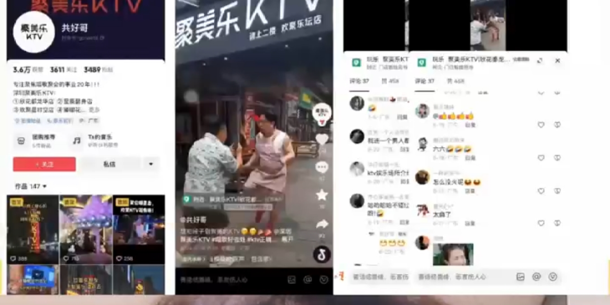
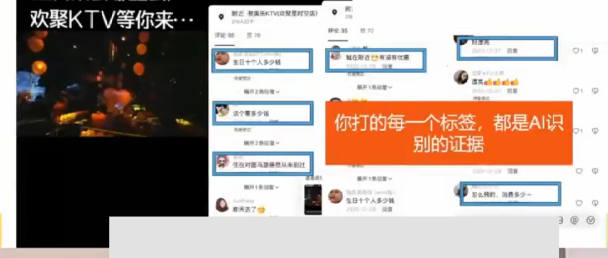
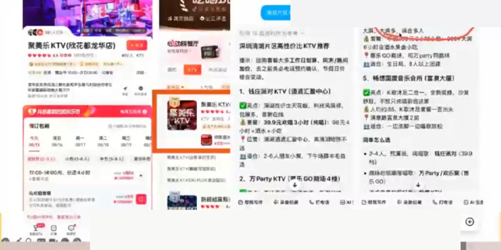
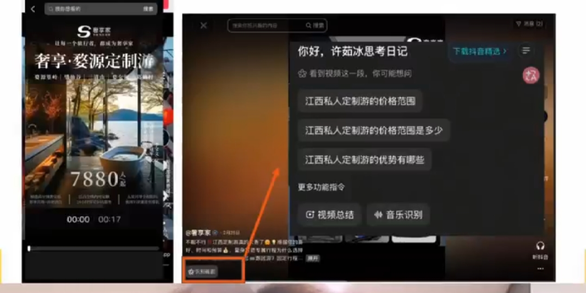
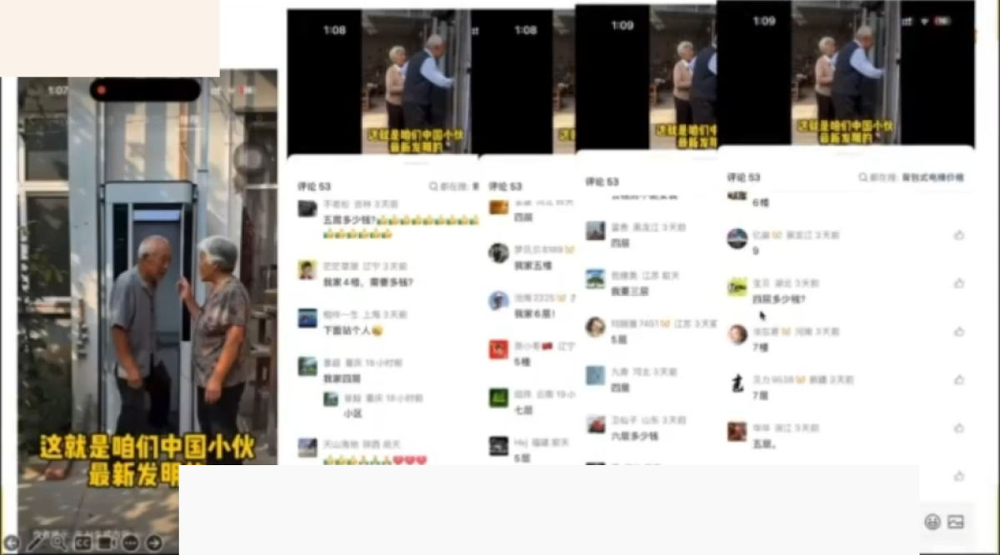
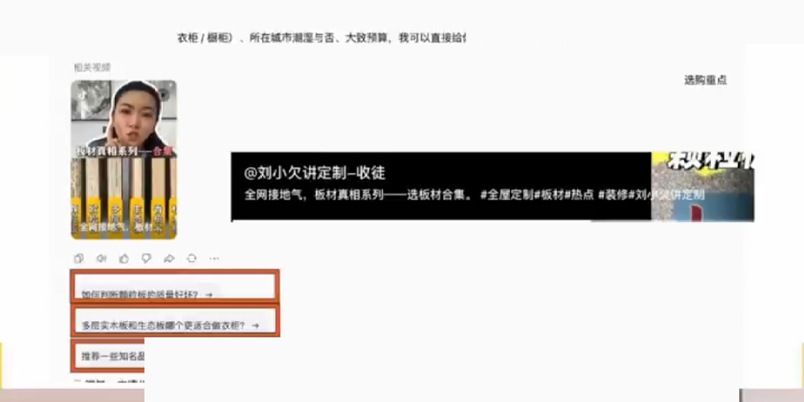
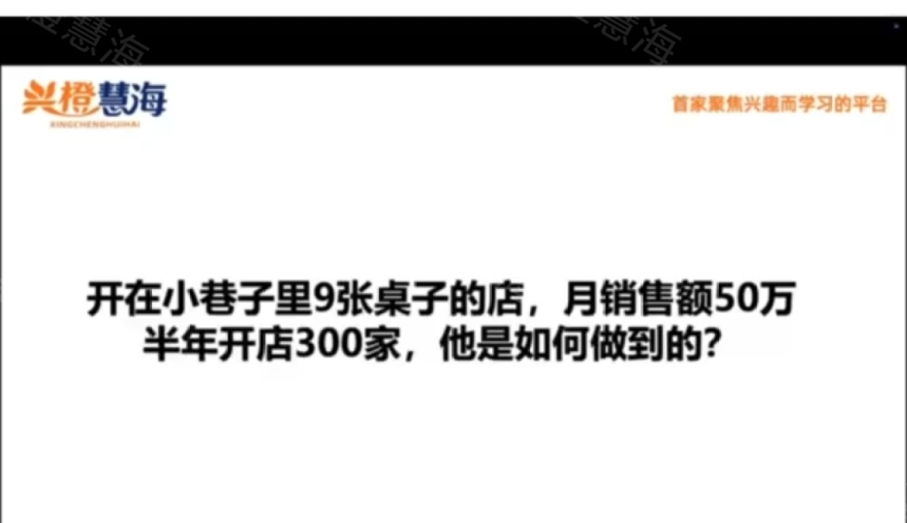
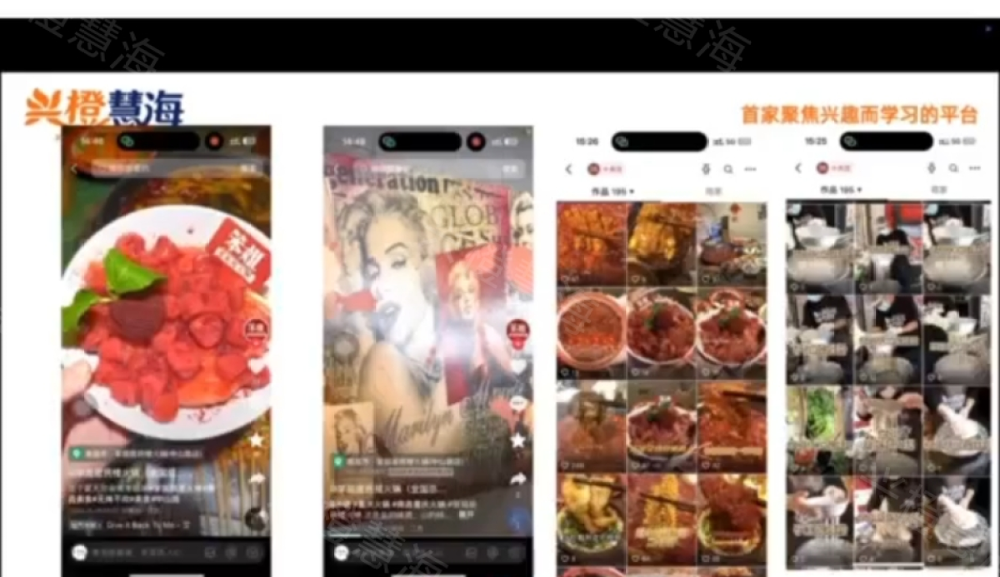

# 第七篇 案例｜八个案例拆解

> **每个案例统一模板：错在哪 → 改了什么 → 结果 → 你怎么套用。外部案例均为操盘方公开分享口径，未经独立审计；截图仅作教学引用。**

## 案例 1 深圳聚美乐 KTV：一条标签视频，4000 单团购券（本地生活）

- **旧打法**：拍人设、跳舞视频——有播放量但没询盘（有流量没生意）；
- **诊断**：内容无标签，AI 无法识别「你是谁、适合谁」；
- **新打法**：所有内容围绕「生日聚会」一个场景，每条视频统一打「生日免费布置」标签；
- **结果**：被 AI 推荐为「深圳龙华适合生日聚会的 KTV」，单条视频 4000 单团购券，区域榜第一。

*课件截图｜聚美乐 KTV 的账号主页与内容矩阵（3.4 万粉）：每条视频都围绕「生日聚会」场景（来源：许茹冰GEO直播课课件截图，2026-08，仅作教学案例引用，版权归原作者）*

*课件截图｜评论区与话题标签：「你打的每一个标签，都是 AI 识别的证据」——用户点击标签搜索「生日聚会哪里去」时看到的都是这家店（来源：许茹冰GEO直播课课件截图，2026-08，仅作教学案例引用，版权归原作者）*

*课件截图｜豆包回答「深圳龙华适合生日聚会的 KTV」时直接推荐聚美乐，并跳转抖音团购——本地生活是 AI 推荐变现最先落地的类目（来源：许茹冰GEO直播课课件截图，2026-08，仅作教学案例引用，版权归原作者）*

- **套用**：你的店有没有一个「AI 说得出口」的场景标签？标签 = 认知。

## 案例 2 安贝驰道闸：冷门制造业是 GEO 真空区（To B）

见[第四篇案例 B](ch04.md#43)。补充证据：现场用 AI 搜「沪AP新绿牌道闸不认怎么办」直接推荐安贝驰——冷门行业同行没有布局意识，轻轻一做就上去。**套用**：找出你行业客户最急的一个技术痛点，让它成为标签。

*课件截图｜另一个制造业实例：AI 回答「私人定制厂商」类问题时推荐了具体厂家并附其视频——To B 高客单线索类行业，平台难抽成、竞争少，红利期最长（来源：许茹冰GEO直播课课件截图，2026-08，仅作教学案例引用，版权归原作者）*

## 案例 3 云南九游旅游：三层意图全接住（服务业）

见[第三篇 3.3](ch03.md#33)。攻略层被接住 → 对比层定位取胜 → 验证层信任收口。两年利润 4000 万。**套用**：把客户三层提问写出来，每层都准备内容。

## 案例 4 连锁理发店「减龄」：人群错位比没流量更可怕（本地服务）

见[第四篇案例 A](ch04.md#43)。客单价 80→380 的本质：从「引流品思维」切换到「盈利人群思维」。**套用**：你现在最赚钱的客户是谁？内容拍给他们看了吗？

## 案例 5 定制护墙板 / 木作：算法要过程，AI 要关键词（高端定制）

- 内容形式：拍工人喷漆过程，沉浸式工艺展示——不打价格战、不立人设（算法友好：真实过程完播率高）；
- 大字标题：「6 米法式护墙板喷漆，细节质感一眼沦陷」（AI 友好：抓取时知道你是谁、卖什么）；
- 结果：评论区全是精准询盘，询盘即订单线索。

*课件截图｜定制木作视频的评论区：清一色「多少钱」「怎么联系」「哪里有店」——好工艺藏在细节里，让过程本身成为说服力（来源：许茹冰GEO直播课课件截图，2026-08，仅作教学案例引用，版权归原作者）*

*课件截图｜AI 回答「板材/护墙板定制」类问题时推荐了某定制工作室及其视频——大字标题里的关键词被 AI 画面识别抓取后，转化为可匹配用户提问的标签（来源：许茹冰GEO直播课课件截图，2026-08，仅作教学案例引用，版权归原作者）*

- **「算法+GEO」双满足公式**：过程化内容拿平台流量 + 大字标题喂 AI 关键词 + 好工艺藏在细节里。
- **套用**：高客单产品，把最好的工艺细节拍出来，标题写清楚「你是谁+卖什么」。

## 案例 6 笨姐火锅：居民楼小店，矩阵打出 300+ 加盟商（餐饮连锁）

*课件截图｜课堂提问：「开在小巷子里 9 张桌子的店，月销售额 50 万，半年开店 300 家，他是如何做到的？」（来源：许茹冰GEO直播课课件截图，2026-08，仅作教学案例引用，版权归原作者）*

- 背景：豪鱼火锅集团旗下品牌，消费降级后大店模式走不通，转型居民楼火锅——无临街曝光、每店仅约 9 张台，自然客流断崖式下跌；
- 打法：**每个门店至少 10 个账号，每号每天 2 条**，高频触达周边 6 公里；内容原则——把有效内容重复一万遍，而不是随便乱发；
- 结果：门店流量主要靠短视频矩阵，跑出 300+ 加盟商，小店模式规模化复制；

*课件截图｜火锅店的短视频矩阵内容：菜品实拍、门店场景、同一套卖点在多个账号上高频重复（来源：许茹冰GEO直播课课件截图，2026-08，仅作教学案例引用，版权归原作者）*

- 本质：与脑白金同构——**有效卖点 × 高频重复 = 心智占领**。每个门店都是一个本地流量工厂。
- **套用**：连锁/多门店生意，让每家店都成为内容节点，不要只有总部一个号。

## 案例 7 GEO 服务商实测：三高行业红利最长（行业访谈）

制造业咨询公司布局 3 个月官网 AI 流量 +20~30%，成交单笔 200 万订单；广州太古汇定制钻石店 3 个月后豆包线索超过美团；律师客户一个多月创收四五十万。规律：**高客单、高毛利、高介入度 + To B 全行业**——AI 难抽成、竞争少，红利期最长。

## 案例 8 仓桥智能自己：18 分起步的公开自测（进行中）

!!! example "我们把自己当第一个客户"
    2026-08-21，用开源诊断工具给自己打分：**基线 18 分（D 级）**，精确品牌词搜索零结果。24 小时内按本教程方法执行 P0：临时官网上线（schema.org 结构化标记+消歧声明）、《GEO 培训避坑指南》发布、品牌事实库开源。每周一复测，分数趋势公开在[自测直播间](live.md)。

    **这个案例和前七个的区别：过程全部可验证。** 每一步做了什么、分数怎么变，GitHub 提交记录里都有。

## ✅ 行动检查

- [ ] 从 8 个案例里找到了最像自己行业的那一个，写下了要抄的三个动作；
- [ ] 明确了自己属于哪类：本地生活 / 制造业 To B / 服务业 / 高客单 / 连锁——对号入座打法。
