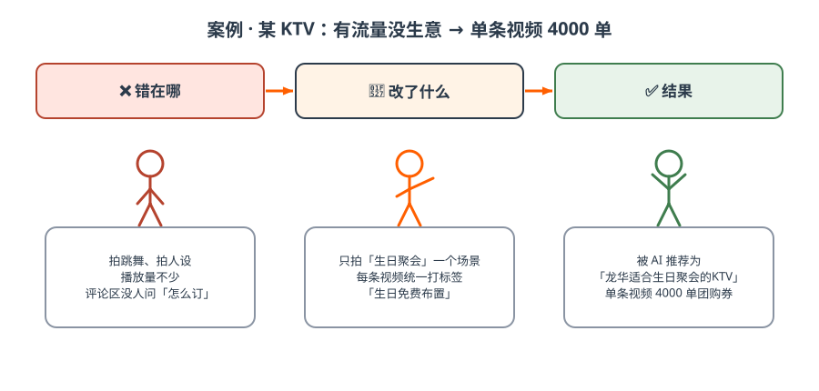
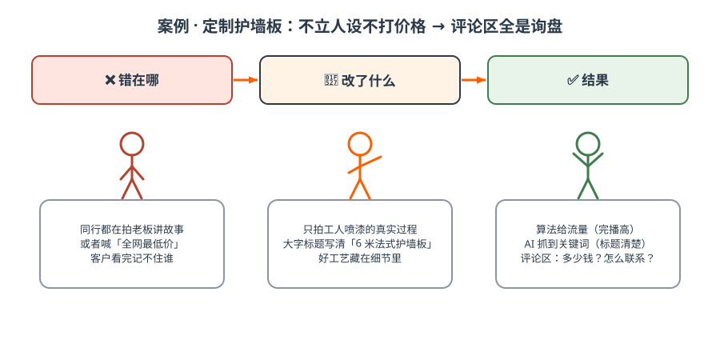
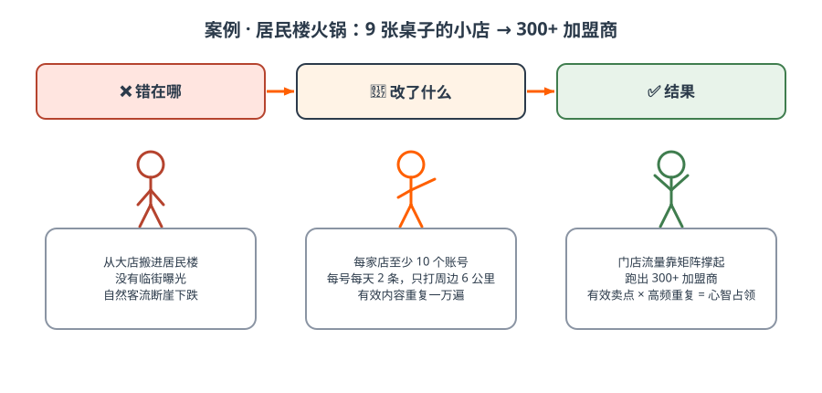

# 第七篇 案例｜七个案例拆解

> **每个案例统一模板：错在哪 → 改了什么 → 结果 → 你怎么套用。外部案例均为操盘方公开分享口径，未经独立审计；截图仅作教学引用。**

## 案例 1 深圳某 KTV：一条标签视频，4000 单团购券（本地生活）

*图解｜有流量没生意 → 只打「生日聚会」一个标签 → 被 AI 点名推荐*

- **旧打法**：拍人设、跳舞视频——有播放量但没询盘（有流量没生意）；
- **诊断**：内容无标签，AI 无法识别「你是谁、适合谁」；
- **新打法**：所有内容围绕「生日聚会」一个场景，每条视频统一打「生日免费布置」标签；
- **结果**：被 AI 推荐为「深圳龙华适合生日聚会的 KTV」，单条视频 4000 单团购券，区域榜第一。
- **套用**：你的店有没有一个「AI 说得出口」的场景标签？标签 = 认知。

## 案例 2 道闸制造企业：冷门制造业是 GEO 真空区（To B）

见[第四篇案例 B](ch04.md#43)。补充证据：现场用 AI 搜「沪AP新绿牌道闸不认怎么办」直接推荐了这家企业——冷门行业同行没有布局意识，轻轻一做就上去。**套用**：找出你行业客户最急的一个技术痛点，让它成为标签。
## 案例 3 云南三人游：AI 怎么选出「那一家」（服务业 · 仓桥实测）

见[第三篇 3.3](ch03.md#33)。同一问题分别问豆包与元宝：豆包先读 17 篇攻略层资料，再按「纯玩小团」定位点名首选；元宝的答案直接引用视频号视频。被选中的不是规模最大的旅行社，而是定位说得最清楚、证据最齐的那家。**套用**：把客户三层提问写出来，每层都准备内容，并把核心定位写成 AI 能一句复述的话。

## 案例 4 连锁理发店「减龄」：人群错位比没流量更可怕（本地服务）

见[第四篇案例 A](ch04.md#43)。客单价 80→380 的本质：从「引流品思维」切换到「盈利人群思维」。**套用**：你现在最赚钱的客户是谁？内容拍给他们看了吗？

## 案例 5 定制护墙板 / 木作：算法要过程，AI 要关键词（高端定制）

*图解｜不立人设不打价格 → 拍真实工艺 + 大字标题 → 评论区全是询盘*

- 内容形式：拍工人喷漆过程，沉浸式工艺展示——不打价格战、不立人设（算法友好：真实过程完播率高）；
- 大字标题：「6 米法式护墙板喷漆，细节质感一眼沦陷」（AI 友好：抓取时知道你是谁、卖什么）；
- 结果：评论区全是精准询盘，询盘即订单线索。
- **「算法+GEO」双满足公式**：过程化内容拿平台流量 + 大字标题喂 AI 关键词 + 好工艺藏在细节里。
- **套用**：高客单产品，把最好的工艺细节拍出来，标题写清楚「你是谁+卖什么」。

## 案例 6 某居民楼火锅品牌：居民楼小店，矩阵打出 300+ 加盟商（餐饮连锁）

*图解｜9 张桌子的小店 → 每店 10 个账号每天 2 条 → 300+ 加盟商*
- 背景：某火锅集团旗下品牌，消费降级后大店模式走不通，转型居民楼火锅——无临街曝光、每店仅约 9 张台，自然客流断崖式下跌；
- 打法：**每个门店至少 10 个账号，每号每天 2 条**，高频触达周边 6 公里；内容原则——把有效内容重复一万遍，而不是随便乱发；
- 结果：门店流量主要靠短视频矩阵，跑出 300+ 加盟商，小店模式规模化复制；
- 本质：与脑白金同构——**有效卖点 × 高频重复 = 心智占领**。每个门店都是一个本地流量工厂。
- **套用**：连锁/多门店生意，让每家店都成为内容节点，不要只有总部一个号。

## 案例 7 GEO 服务商实测：三高行业红利最长（行业访谈）

制造业咨询公司布局 3 个月官网 AI 流量 +20~30%，成交单笔 200 万订单；广州某商场定制钻石店 3 个月后豆包线索超过美团；律师客户一个多月创收四五十万。规律：**高客单、高毛利、高介入度 + To B 全行业**——AI 难抽成、竞争少，红利期最长。

## ✅ 行动检查

- [ ] 从 7 个案例里找到了最像自己行业的那一个，写下了要抄的三个动作；
- [ ] 明确了自己属于哪类：本地生活 / 制造业 To B / 服务业 / 高客单 / 连锁——对号入座打法。
