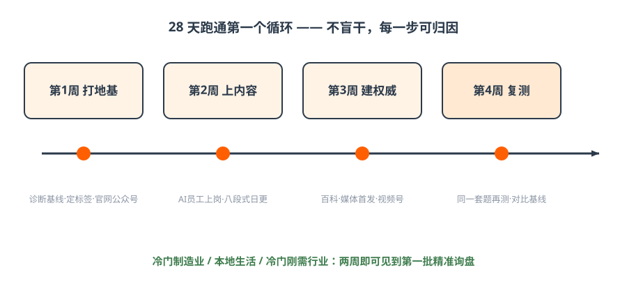
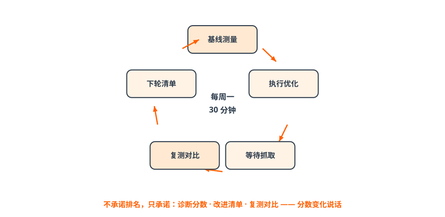

# 第八篇 行动｜28 天起盘与 90 天三战役

> **一句话总结：28 天跑通第一个循环（地基→内容→权威→复测），90 天打完三场战役；避开五个误区，就赢了一半。**

## 8.1 28 天起盘路线图

!!! quote "小剧场 · 第 28 天"
    周一早上八点半，小林把复测表拍在老周桌上：20 个问题，基线时品牌出现 0 次，这周出现 6 次，其中 2 次是「首选」——问的正是「新绿牌识别」那类问题。
    老周看了很久：「下个月呢？」
    小林：「下个月打百科和媒体报道，让 AI 敢信我们。」
    老周：「行。展会，明年不去了。」
    ——本篇给你这 28 天的逐周清单。（人物为教学虚构，数字为示意）

*图解｜四周一循环：打地基 → 上内容 → 建权威 → 复测对比*

| 周 | 主题 | 动作清单 | 里程碑 |
| --- | --- | --- | --- |
| 第1周 | 打地基 | ✅领取诊断基线 ✅标签化三步法定标签 ✅官网/认证公众号补齐 ✅检查4大账号（蓝V/公众号/小程序/视频号） | 基线分数+1句标签 |
| 第2周 | 上内容 | ✅AI员工上岗（五步法） ✅三层意图词各20个 ✅八段式内容上线官网+公众号，日更启动 | 60个意图词+首批内容可被抓取 |
| 第3周 | 建权威 | ✅百度百科词条 ✅1篇权威/垂直媒体首发 ✅视频号开动（先1个专家号） ✅同一内容≥3平台互证 | 第三方证据入场 |
| 第4周 | 复测迭代 | ✅同一套20问复测 ✅对比基线分数 ✅按P0/P1排下月计划 | **复测报告：分数变化可见** |

*图解｜四周实验法循环：基线→执行→等待抓取→复测→下轮清单——不盲干，每一步可归因*

冷门制造业 / 本地生活 / 冷门刚需行业：**两周即可见到第一批精准询盘。**

## 8.2 90 天三场战役（全面铺开）

| 战役 | 目标 | 投入 | KPI |
| --- | --- | --- | --- |
| 第一战 短视频矩阵曝光战（救眼前） | 3 个月做出 1 个 5 万粉矩阵号 | 1 人+1 套设备+1 套 AI 工具 | 每周 ≥30 条内容 + ≥50 条线索 |
| 第二战 GEO 未来战（赢未来） | 3 个月进入 3 大 AI 推荐位 | 1 个 AI 员工+持续内容 | 每周 ≥5 篇 + 收录率 ≥80% |
| 第三战 AI 组织人才战（提效率） | 每个员工配 1 个 AI 助理 | 2 周培训+5 步法训练 | 人均产能提升 ≥3 倍 |

三场战役同时打——任何一场不打，都会掉队。90 天三阶段：1~15 天定位与阵地 → 16~45 天内容与 AI 员工 → 46~90 天矩阵与调优（推荐位进前 4）。

!!! success "算一笔账 · 五个误区的学费 vs 28 天的成本"
    五个误区按公开案例平均每个 50~500 万学费，加起来 ≈ 800 万；28 天起盘的真实投入：一个人半天训练 AI 员工 + 每天 5 分钟审稿 + 平台月费百元级 + 百科几百元。
    **不是 GEO 贵，是走错路贵。**

## 8.3 五个最常见的误区（每个都是真金白银的学费）

1. **只抢购买词，不做意图前端**——漏掉 80% 潜在客户（某教育品牌损失约 200 万）；
2. **没有定位乱铺内容**——等于给 AI 投毒（某餐饮被全网屏蔽，损失约 80 万）；
3. **一次性海量铺量**——一次性高粱米不如一年小米粥（某零售归零重做，损失约 150 万）；
4. **品牌名/卖点全网不统一**——AI 无法验证=不推荐（某制造业线索被截胡，损失约 100 万）；
5. **GEO 和短视频矩阵割裂**——两条腿缺一（损失约 300 万）。

避开 5 个误区 = 至少省 800 万学费。

## 8.4 攻防问答：别人问你，你怎么答

??? question "「GEO 能保证排第一吗？」"
    不能承诺固定排名。承诺的是：诊断分数、改进清单、28 天复测对比——用数字说话。遇到承诺保排名的服务商，参见《[GEO 培训避坑指南](https://github.com/cangqiaoGEO/OpenGEO/blob/main/guides/geo-training-anti-scam-guide.md)》。

??? question "「多发内容是不是就行？」"
    低质软文=投毒会被拉黑；重点是地基+证据+口径一致。

??? question "「GEO 会取代 SEO 吗？」"
    SEO 让你进候选池，GEO 让你被选中——是叠加不是取代。

??? question "「多久见效？」"
    冷门行业快（两周见询盘）、竞争行业慢；两块地基不补，分数不会动。

## 8.5 课后 24 小时必做清单

- [ ] 完成定位：用三步法写出 1 句核心标签；
- [ ] 检查 4 大账号：蓝V / 认证公众号 / 小程序 / 视频号，缺的排期开通；
- [ ] 生成品牌诊断基线（拿到分数）；
- [ ] 把 28 天表贴到办公室。

!!! tip "结课金句"
    **短视频解决当下生存，GEO 布局未来，AI 放大组织——三者缺一不可，现在开始，正好赶上红利早期。**
