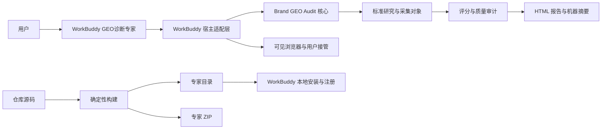

## Brand GEO Audit 工程架构

### 一、为什么需要这套架构

`brand-geo-audit` 同时包含两种性质不同的能力：一部分是与宿主工具解耦的 GEO 诊断逻辑，另一部分是 WorkBuddy 如何打开浏览器、交还登录控制权、注册专家和生成 ZIP

如果两者混在一起，会出现两个直接问题：核心 Skill 被某个宿主工具绑定，专家发布文件只存在于开发者本机，其他开发者无法从仓库复现同一专家

因此当前架构解决的不是“再支持更多终端”，而是先建立一个清晰边界：诊断核心只表达业务与证据，WorkBuddy 适配只表达宿主运行和发布

记忆锚点：核心定义诊断，适配连接宿主，构建生成产物

### 二、总体模型



这张图包含两条不同但相交的链路：上半部分是一次诊断如何运行，下半部分是专家如何从源码发布

运行链路消费已经安装的专家，发布链路不参与业务评分；两条链路只通过构建后的专家包相交

### 三、四层责任与依赖方向

| 层 | 责任 | 源码位置 | 允许依赖 |
|---|---|---|---|
| 领域核心 | 研究边界、实体、查询、证据、评分、审计和报告 | `SKILL.md`、`schemas/`、`scripts/`、`references/` | 标准库和稳定契约 |
| 宿主契约 | 规定浏览器、身份交接、密钥读取和产物写入能力 | `references/runtime/host-runtime-contract.md` | 核心采集对象 |
| WorkBuddy 适配 | 专家定义、可见浏览器运行时和 WorkBuddy 发布规则 | `adapters/workbuddy/` | 宿主契约与核心 Skill |
| 生成产物 | 专家目录、ZIP、本地安装和真实诊断文件 | `work/`、`~/.workbuddy` | 对应版本的源码构建结果 |

依赖只能从 WorkBuddy 适配指向宿主契约和核心，核心不得反向读取 `.codebuddy-plugin`、`~/.workbuddy` 或 `agent-browser` 安装目录

核心文档可以把 WorkBuddy 作为当前产品载体和默认使用语境，但不得依赖 WorkBuddy 的工具名、安装路径或页面操作机制

物理路径也不等于责任真源：`~/.workbuddy` 中虽然存在一份完整专家目录，但它是安装结果，不是应该人工维护的源码

### 四、一次诊断如何运行

以匿名的区域专业服务品牌为例，用户希望了解它在本地品类推荐中的表现

1. WorkBuddy 专家接收品牌、地域、业务领域和目标受众
2. 核心 Skill 建立 `ResearchScope`、`DomainContext`、品牌实体和行业适配，再冻结 `QueryProtocol`
3. WorkBuddy 适配器把冻结查询交给用户可见的浏览器，并判断页面是可提问、需登录、需验证还是异常
4. 若页面要求身份操作，适配器内部进入用户接管状态，并以 `RawPlatformResponse.status: blocked_auth` 跨越核心边界，由用户本人完成登录或验证
5. 浏览器回答被整理为 `RawPlatformResponse`，只保留回答、明示引用、页面地址、时间和截图等原始证据
6. 核心链路再完成实体复核、`ObservationEvidence`、查询族汇总、评分和质量审计
7. 报告器生成 HTML 报告和机器摘要

核心不关心页面是由哪个命令打开，只要求适配器满足 [宿主运行时契约](../references/runtime/host-runtime-contract.md) 并输出标准对象

适配器也不解释品牌是否被推荐，它只负责可靠地取得原始证据；否则宿主页面规则会污染评分口径

当前存在两条浏览器入口，责任不同：

- WorkBuddy 产品链路使用专家包内的 `geo-browser-runtime`，由它准备并调用可见的 `agent-browser`，这是四平台正式运行入口
- `scripts/browser_collect.mjs` 是仓库内的独立 Playwright 开发工具，用于受控调试和回归，不是 WorkBuddy 适配器，也不会随专家包安装项目级 Playwright

### 五、专家如何从源码生成

```text
adapters/workbuddy/expert/ 模板
            +
当前 brand-geo-audit 运行文件
            ↓
build_expert.py
            ↓
密钥扫描与边界检查
            ↓
work/mvp-release/geo-diagnostic-expert/
work/mvp-release/geo-diagnostic-expert.zip
            ↓
install_local.py
            ↓
WorkBuddy 临时安装位 → 官方校验 → 原子替换 → 注册
```

构建脚本采用运行文件白名单，只复制 `SKILL.md`、运行文档、Schema、示例、脚本和包清单

它不会复制 `.env`、`work/`、`tests/`、`node_modules/`、缓存或 `adapters/`，因此不会递归打包自身，也不会把本地案例或凭证带入专家包

安装脚本先把构建结果复制到 WorkBuddy 专家目录下的临时位置，因为官方校验器只接受该目录中的专家；校验成功后才替换当前安装，注册失败时恢复旧版本

### 六、三种“真源”不要混淆

| 问题 | 权威位置 | 非权威副本 |
|---|---|---|
| GEO 如何诊断 | `skills/S1-diagnosis/SKILL.md` 与核心契约 | 专家包中的 `skills/brand-geo-audit/` |
| WorkBuddy 如何承载专家 | `adapters/workbuddy/expert/` | `~/.workbuddy/.../geo-diagnostic-expert/` |
| 当前方法和实现到什么程度 | `docs/SPEC.md` 与方法学文档 | 单次报告、历史研究记录 |

当三者发生差异时，修改仓库源码并重新构建，不直接修补 ZIP 或 `~/.workbuddy`

### 七、安全和控制权边界

- API Key 只从环境变量读取，不进入源码、标准对象、报告和专家包
- `.env` 与所有真实运行目录由 Git 忽略
- 浏览器 Cookie、验证码和完整页面 HTML 不进入 `RawPlatformResponse`
- 登录、重新登录、账号选择、密码、验证码、OAuth、设备授权和权限开通由用户本人完成
- 浏览器必须以可见窗口运行，不能用后台无头结果冒充消费者 App 实测
- WorkBuddy 适配可以安装无身份信息的浏览器运行时，但不能扩大为系统授权或平台身份操作

### 八、版本边界

| 版本位置 | 表达对象 | 当前值 |
|---|---|---|
| `SKILL.md` | GEO 诊断核心工作流 | `0.6.0` |
| `.codebuddy-plugin/plugin.json` | WorkBuddy 专家分发包 | `0.3.0` |
| `geo-browser-runtime/SKILL.md` | WorkBuddy 浏览器运行时适配 | `0.2.0` |
| `package.json` | 独立 Playwright 开发工具依赖包 | `0.2.0` |

这些版本描述不同对象，不要求数值同步；修改哪个责任层，就只提升对应版本，并重新运行完整构建与测试

### 九、当前实现与非目标

当前已经实现：

- 与宿主工具解耦的研究、证据、评分、审计和报告链路
- 宿主运行时契约
- WorkBuddy 单专家适配源码
- 可见 `agent-browser` 运行时自检
- 可重复的专家目录与 ZIP 构建
- WorkBuddy 官方校验、原子本地安装和注册

当前不包含：

- Codex 或 Claude 适配器
- WorkBuddy 专家团编排
- 自动代替用户完成任何登录或授权
- 已经外部验证的 GEO 行业评分标准

新增其他宿主不是当前任务，未来若确有需要，应增加新的适配目录，而不是修改核心契约来迎合某个工具

当前登记偏差：根 `SKILL.md` 和报告默认文案仍会出现 WorkBuddy，因为它是目前唯一的产品载体；这些表述不构成运行时依赖，若未来接入其他宿主，应先抽取独立的产品配置层，再扩展适配器

### 十、开发者应如何判断改动位置

- 改指标、实体、查询、证据、评分或报告：修改核心源码
- 改 WorkBuddy 展示、专家 Prompt、浏览器启动或安装：修改 `adapters/workbuddy/`
- 改浏览器与核心之间的通用语义：修改宿主运行时契约，并同步适配器和测试
- 改真实案例或实验数据：只修改 Git 忽略的 `work/`
- 改 ZIP 或本地安装：不要手工修改，重新运行构建和安装脚本

最终记忆模型：源码定义责任，契约隔离变化，构建产生副本
