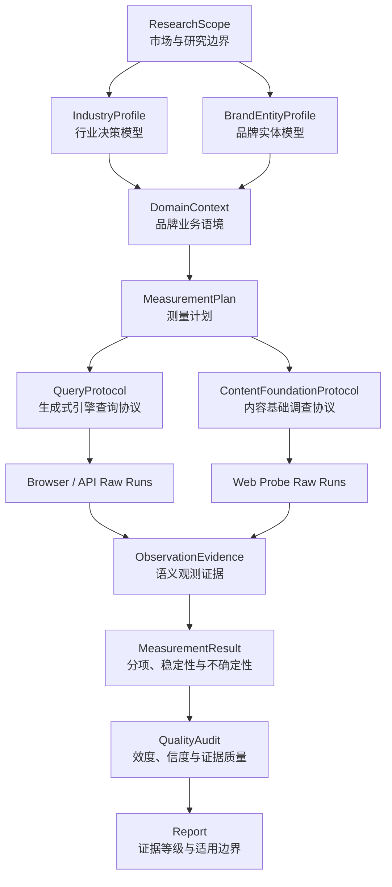

## Brand GEO Audit 测量架构与 R1 实现边界

### 一、为什么需要重建底座

品牌名称不是稳定测量对象，同一名称可能指向产品品牌、公司、门店、区域经营名称或无关同名主体

如果领域模型没有表达行业决策因素，查询即使形式统一，也可能系统性遗漏客户真正关心的内容；如果内容基础没有独立协议，AI 引擎采集完成后仍可能留下整维未知

候选架构需要同时解决三个问题：对象不能认错，问题不能问偏，结果不能过度解释

### 二、目标测量模型



记忆锚点：先认实体，再建行业，再冻协议；先留原始，再做判断，最后评分

### 三、三层领域模型

#### 3.1 通用业务层

所有行业共享的最小决策结构：

- 目标客户
- 客户问题
- 产品或服务
- 使用场景
- 竞品和替代方案
- 高价值问题

这层保证不同品牌使用相同的认知骨架，但不宣称已经覆盖行业独特性

#### 3.2 行业适配层 `IndustryProfile`

候选对象至少应讨论：

- 行业定义、边界和价值链角色
- 购买者、使用者、影响者和审批者
- 决策因素及其重要性来源
- 行业特有证据类型
- 合规、资质和风险约束
- 常见产品、服务和交付模式
- 行业术语、别名和高风险混淆
- 决策旅程和高价值问题族
- 不适用于该行业的通用指标

每个行业决策因素必须引用来源或客户访谈，不允许仅凭 Agent 常识进入冻结协议

#### 3.3 品牌实体层 `BrandEntityProfile`

候选对象至少应讨论：

- 规范品牌名和实体类型
- 公司、品牌、产品线、门店和运营主体的关系
- 官方别名和历史名称
- 明确排除的同名实体
- 官方域名和账号
- 服务地域和时间边界
- 每项实体关系的来源、状态和置信度

实体关系未达到可用门槛时，品牌直达和品牌对比查询不得形成正式结论

### 四、匿名教学示例：区域专业服务品牌

以下内容只用于解释架构关系，可以被其他示例替换或直接删除，不对应仓库中的任何真实品牌测试数据，也不构成 Schema 字段依据

通用业务层只能表达某区域专业服务品牌面向特定客户提供产品和项目交付

行业适配层需要调查，而不是预先假定：

- 产品提供者、服务提供者和实际经营主体是否为同一角色
- 授权、资质、项目经验和真实交付能力之间是什么关系
- 不同客户场景是否具有不同的技术、流程和验收条件
- 售前设计、实施、验收和售后是否属于不同能力
- 哪些证据真正影响该行业的采购判断

品牌实体层必须进一步确认：

- 对外名称是正式品牌、区域经营名称还是口语称呼
- 经营主体、代理设备品牌和相关门店分别是什么关系
- 哪些网站和账号由目标主体控制
- 哪些案例、授权和承诺可以归属于该主体

没有这两层，通用字段虽然完整，查询仍可能把设备品牌、同名主体或关联经营方的信息混入目标品牌

### 五、领域模型到协议的编译关系

`QueryProtocol` 是冻结的生成式引擎测试契约，不是领域模型副本

目标版本中每条查询应直接引用：

- `audience_ids`
- `problem_ids`
- `product_ids`
- `scenario_ids`
- `industry_factor_ids`
- `high_value_question_ids`
- 必要时引用 `competitor_ids`

这样可以计算：

- 通用对象覆盖率
- 行业决策因素覆盖率
- 高价值问题覆盖率
- 竞品校准覆盖率

当前 v2 只直接关联客户、问题、高价值问题和部分竞品；产品、场景和行业因素没有完整进入查询契约，因此属于待迁移结构

### 六、两类协议必须分离

#### 6.1 `QueryProtocol`

负责测量生成式引擎在固定问题下如何表达品牌：

- 是否出现
- 出现位置
- 是否推荐
- 使用哪些引用
- 覆盖哪些信息
- 情感和条件限制
- 是否出现实体或事实错误

#### 6.2 `ContentFoundationProtocol`

负责测量生成式引擎之外的公开内容供给：

- 百科与实体库探针
- 官方网站归属和可索引性探针
- 结构化数据探针
- 权威第三方内容探针
- 知识图谱探针
- 近期内容活跃度探针

每个探针必须定义目标实体、检索入口、查询、时间窗口、纳入和排除标准、原始证据、失败状态及验收标准

只有两个协议都达到其完成门槛时，报告才能称为完整 GEO 诊断；只完成生成式引擎查询时，应明确标记为“AI 答案观测报告”

### 七、证据链和状态门槛

```text
raw completed
  -> contract valid
  -> semantic annotation complete
  -> sample sufficient
  -> repeatability characterized
  -> dimensions measurable
  -> quality audit passed
  -> formal interpretation allowed
```

`valid=true` 只表示结构和引用关系没有错误，不代表样本充分；`measured` 只表示查询矩阵达到当前门槛，不代表指标已经获得科学效度

R1 已增加轻量 `MeasurementPlan`，冻结查询映射、关键查询、通道隔离和禁止跨场景抵消的聚合策略

完整目标版本还需继续冻结：

- 方法论和指标配置版本
- 行业配置版本
- 品牌实体配置版本
- 两类协议版本
- 平台、模型、模式和通道
- 重复次数和聚合规则
- 标注者与一致性要求
- 缺失数据处理
- 正式结论门槛

### 八、通用性与独特性的验收指标

| 指标 | 计算口径 | 解决的问题 |
|---|---|---|
| 通用模型完整度 | 已成立的通用对象数 / 必需通用对象数 | 通用骨架是否完整 |
| 行业因素覆盖度 | 已进入协议的行业因素权重 / 行业因素总权重 | 是否覆盖行业独特决策逻辑 |
| 品牌证据专属性 | 精确匹配目标实体的有证据声明 / 全部品牌声明 | 内容是否真正属于目标品牌 |
| 实体污染率 | 错误或模糊实体声明 / 全部品牌声明 | 是否混入同名或关联主体 |
| 查询可追溯覆盖率 | 已被查询覆盖的高价值问题权重 / 高价值问题总权重 | 查询是否代表真实业务问题 |
| 内容探针完成率 | 已完成且有原始证据的探针 / 冻结探针总数 | 内容基础是否实际调查 |

上述口径进入目标架构后仍属于待校准指标，不能仅凭定义存在就宣称有效

### 九、v2 基线、R1 实现和后续边界

| 能力 | v2 基线 | R1 当前实现 | 后续目标 |
|---|---|---|---|
| 通用业务模型 | `DomainContext` | 保持兼容 | 版本化行业映射 |
| 行业适配层 | 无独立对象 | 轻量 `IndustryProfile` | 多行业内容效度校准 |
| 品牌实体层 | 普通字段和未知项 | `BrandEntityProfile` 支持别名、门店、地点和关系 | 实体污染率与自动对齐 |
| 生成式查询协议 | 已实现 | `MeasurementPlan` 外部映射行业因素与地点 | 继续迁入产品和场景引用 |
| 内容基础协议 | 只有结果字段 | 独立 `ContentFoundationProtocol` | 原始探针运行与结果契约 |
| 报告模式 | 无 | 默认 `diagnostic`，内部 `experimental_score` | 外部验证后才考虑 `validated_score` |
| 重复实验 | 独立对象 | 尚未投影到正式结果 | 进入不确定性计算 |
| 指标配置版本 | 隐含在代码版本中 | 未解决 | 显式 `metric_profile_version` |

R1 只是已通过自动化验证的契约切片，尚未完成 WorkBuddy Tool 绑定、多品牌试点和外部效度验证，不得表述为已经科学定型的 v3

迁移期间，v2 报告继续可复算，但必须标记 `experimental`；未来版本不得静默读取 v2 输入并生成可比较分数

任何真实品牌测试案例都只用于验证对象是否足够表达实际问题，不得反向成为通用 Schema 或指标定义的唯一依据
