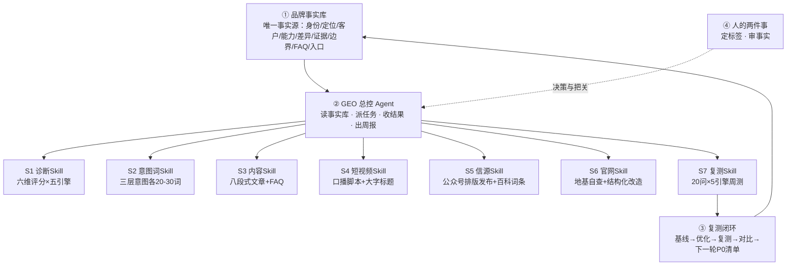

# 仓桥 GEO 作战系统 · 架构与叙事 V1.0

> **一句话叙事：1 个品牌事实库 + 1 个 GEO 总控 Agent + N 个专业 Skill + 复测闭环。**
> 定位：《GEO没那么难》课程的技术产品化框架，也是对外交付（起盘/陪跑）的系统底座。
> 来源：竞品「知识库+总控Agent+7 Skill」叙事借鉴 + 仓桥自有技术栈（Claude Code / Agent 流水线 / brand-geo-audit 诊断工具）落地化。

---

## 一、为什么要这个叙事

- 「AI员工」的说法人人在讲，已经没有技术势能；「作战系统」把我们真实的工程能力（诊断工具、Agent流水线、复测监测）组织成**一个可看见、可交付、可复用的系统**；
- 与竞品的关键差异一句话：**他们的 Agent 止于「生成方案」，我们的系统闭环到「复测分数」**——多了最后一环，性质就从「演示」变成「交付」；
- 课堂上讲系统架构图，销售时卖系统交付，服务时按系统分工执行——一套叙事三处复用。

## 二、系统架构（一页图）

**记忆口诀（课堂板书）**：

> 一库定口径，一脑管调度，七技各干活，复测闭了环；老板两件事——定标签、审事实。

## 三、四层组件定义

### ① 品牌事实库（数据层 · 唯一事实源）

- 载体：飞书文档/多维表格（教材附录A的11字段模板）；
- 铁律：所有 Skill 只准引用事实库，不准编造——事实库没有的信息，内容里就不能出现；
- 更新权：老板/负责人（这是「审事实」的抓手），每条字段带来源与更新时间。

### ② GEO 总控 Agent（调度层）

- 职责：读事实库 → 按周计划给各 Skill 派任务 → 校验产出（80%标准线自查）→ 汇总周报给老板；
- 实现：Claude Code Agent 编排（我们现成的流水线），轻量版可用腾讯 WorkBoard/元器给学员自建；
- 老板界面：每周只看一份周报——发了什么、被谁收录、分数动没动、下周做什么。

### ③ N 个专业 Skill（执行层 · 当前 N=7）

| Skill | 干什么 | 输入 → 输出 | 我们已有的实现 |
| --- | --- | --- | --- |
| S1 诊断 | 六维评分×五引擎基线报告，P0/P1/P2清单 | 品牌名+行业 → 诊断报告HTML | brand-geo-audit 工具（小米81/食养八方36实例） |
| S2 意图词 | 倒推三层意图（攻略/对比/口碑） | 事实库 → 每层20~30词清单 | 提示词模板（教材附录C扩展） |
| S3 内容 | 八段式GEO文章：三层标题+证据+FAQ | 事实库+1个意图词 → ≥800字文章 | Agent流水线（成本个位数元/篇） |
| S4 短视频 | 口播脚本+大字标题+标签方案 | 事实库+场景 → 脚本（算法+AI双满足） | 护墙板公式模板化 |
| S5 信源 | 公众号排版定时发布、百科词条草稿、多平台同步 | S3产出 → 已发布内容（≥3平台互证） | lark/公众号工具链 |
| S6 官网 | 地基7条自查、结构化改造清单、FAQ页生成 | 现有官网 → 整改清单+页面稿 | 独立站建站能力（1500-2000交付项） |
| S7 复测 | 固定20问×5引擎周测，记录提及/推荐/引用/准确 | 问题集 → 周监测表+趋势 | 诊断工具复测模式 |

> N 是开放的：行业扩展时加 Skill（如本地生活团购Skill、出海独立站Skill），系统不变。

### ④ 复测闭环（验证层 · 我们独有的一环）

基线测量（S1）→ 四周执行（S2-S6）→ 复测对比（S7）→ 生成下一轮 P0 清单 → 回写事实库。
**对外承诺口径不变：不承诺排名，承诺「诊断-改进-复测」三件套，分数变化说话。**

### 人机分工（贯穿）

老板只做两件事：**定标签**（S2启动前拍板）、**审事实**（事实库更新+内容抽检）；其余全部系统执行。Agent 参与诊断、生产与监测，人在方向、边界与里程碑上做选择。

## 四、对外话术（三个场景）

- **课堂版**：「今天教的四步法，回去不用靠意志力执行——它已经被我们做成了一套作战系统：一库、一脑、七技、一环。你们现场看到的诊断报告，就是 S1 跑出来的。」
- **销售版**：「市面上的 GEO Agent 帮你生成方案就结束了；我们的系统多一环——28 天后同一套题复测，分数不动我们自己先交代。」
- **攻防版**（被问和竞品Agent区别）：「架构大家都会画，区别看两点：他们的 Skill 有没有接你的真实发布渠道？他们敢不敢把复测写进交付？」

## 五、课程与交付植入点

1. **课程工具篇（模块4）**：架构图1页 + 现场演示映射（诊断演示=S1、AI员工写文=S3）；
2. **1对1预约（会后独立环节，借鉴点②）**：四选一议题——诊断报告解读（S1）/ 28天启动排期（总控）/ 官网公众号地基（S5+S6）/ AI员工搭建（S3）；
3. **交付阶梯重述**：免费诊断=S1单跑；GEO起盘=S1+S5+S6+事实库；28天陪跑=全系统上线+S7周报（交付形态示例，非报价）；
4. **宣发（借鉴点③）**：时间轴长图已上线（海报/GEO公开课时间轴长图-0822.png），下次活动沿用该信息架构。

