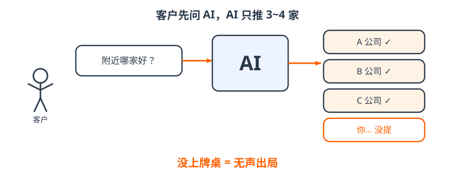

# 1 · 问题｜客户去问 AI 了

- 客户有需求，先问豆包、元宝、DeepSeek，不再翻十页搜索结果；
- AI 一次只推 3~4 家，其余连名字都不出现；
- 所以新问题不是「排第几」，而是「**有没有上牌桌**」。

!!! tip "一句话"
    让 AI **看见你 → 看懂你 → 相信你 → 推荐你**，这就是 GEO。

??? question "自测：AI 为什么没提到我们？"
    AI 只读它能检索到、能核实的资料。官网不可抓取、百科没有、口径混乱，它就当你不存在——大公司也可能是 18 分。
