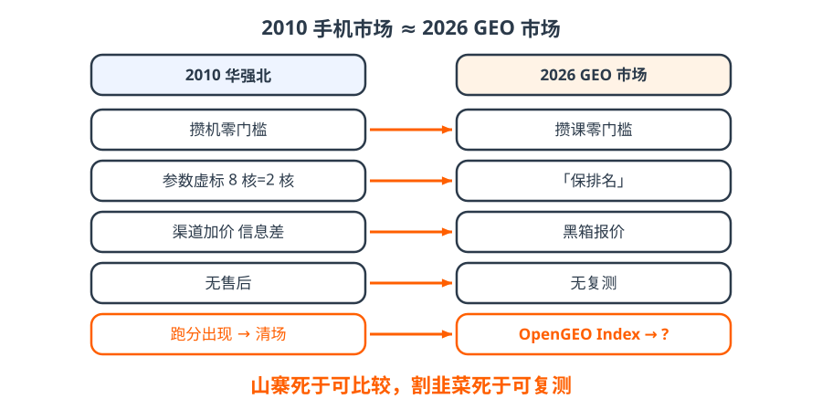

# 2 · 历史｜华强北又来了

- 2010 年：攒机零门槛 → 参数虚标 → 信息差定价 → 没售后；
- 2026 年：攒课零门槛 → 「保排名」 → 黑箱报价 → 不复测；
- 山寨机不是被更便宜杀死的，是被**安兔兔跑分**杀死的——可比较了，虚标就没处藏。

!!! tip "一句话"
    **山寨死于可比较，割韭菜死于可复测。** 我们要做的就是那把尺子。

??? question "自测：安兔兔有什么教训？"
    两条：① 它被当成「小米系」，裁判被质疑偏向；② 厂商对跑分作弊。所以我们的尺子要放在开源组织里、要防投毒、默认不迷信总分。
