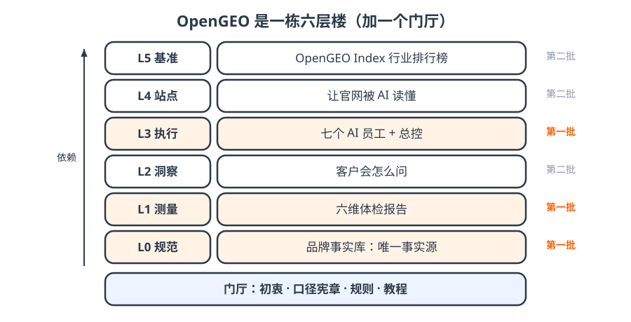

# 3 · 全貌｜六层楼

| 层 | 一句话 | 仓库 |
| --- | --- | --- |
| L0 规范 | 品牌事实库，唯一事实源 | opengeo-spec |
| L1 测量 | 六维体检 + 周测 | opengeo-audit |
| L2 洞察 | 客户会怎么问、内容缺什么 | opengeo-insights |
| L3 执行 | 总控 + 七个 AI 员工 | opengeo-skills |
| L4 站点 | 官网让 AI 读得懂 | opengeo-agentready |
| L5 基准 | OpenGEO Index 行业排行榜 | opengeo-index |

!!! tip "一句话"
    先盖 **L0 / L1 / L3** 三层（第一批），其余三层是第二批。所有楼层都踩在 L0 上。

??? question "自测：为什么 L0 在最底下？"
    每一层都只准引用事实库里「老板确认过」的事实。事实不稳，上面全是空中楼阁。
