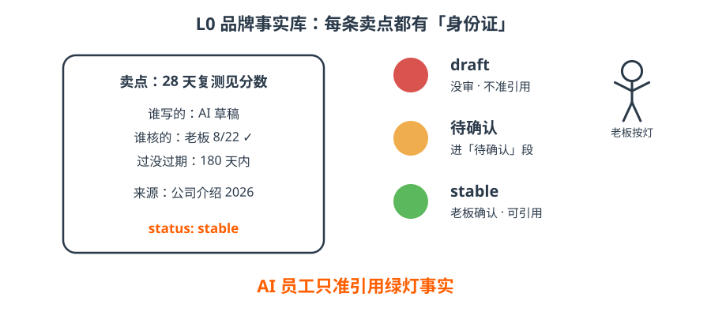

# 4 · L0｜事实库的身份证

- 每条卖点一个文件，顶上有张「身份证」：谁写的、谁核的、过没过期、来源是什么；
- 三个灯：**draft** 红灯（没审，不准引用）→ **待确认** 黄灯 → **stable** 绿灯（老板确认，可引用）；
- `okf_lint` 一键检查：没身份证、红灯冒充绿灯、过期、断链、两处口径打架，全部报出来。

!!! tip "一句话"
    **老板只做两件事：定标签、按绿灯。** 其余交给 AI 和 lint。

??? question "自测：一条 stable 的事实，AI 一定能引用吗？"
    还要看 `verified.by`：`human:` 是人确认（可引用）；`tool:` / `machine:` 是机器确认，只能当数据（分数、日期）引用。
