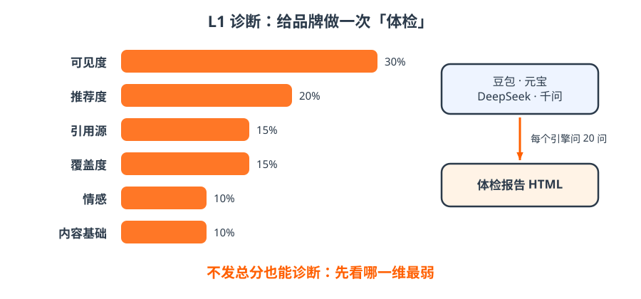

# 5 · L1｜体检报告

- 固定 20 问，在每个 AI 引擎逐条问，记录：提到没、推荐没、引用了谁、说得对不对；
- 六个维度按权重合成：可见度 30 / 推荐度 20 / 引用源 15 / 覆盖度 15 / 情感 10 / 内容基础 10；
- 默认 **diagnostic 模式不发总分**，只告诉你哪一维最弱、先补什么；要发总分，必须同时附改进清单。

!!! tip "一句话"
    **一条命令：采集好的证据 → 评分 → 审计 → HTML 报告 → 写回事实库。** 分数不是目的，复测对比才是。

??? question "自测：采集为什么不能放到 GitHub 自动跑？"
    中国引擎没有开放接口，只能用自己的账号、可见浏览器、低频慢慢问；失败就停，人来接手，绝不伪造数据。
