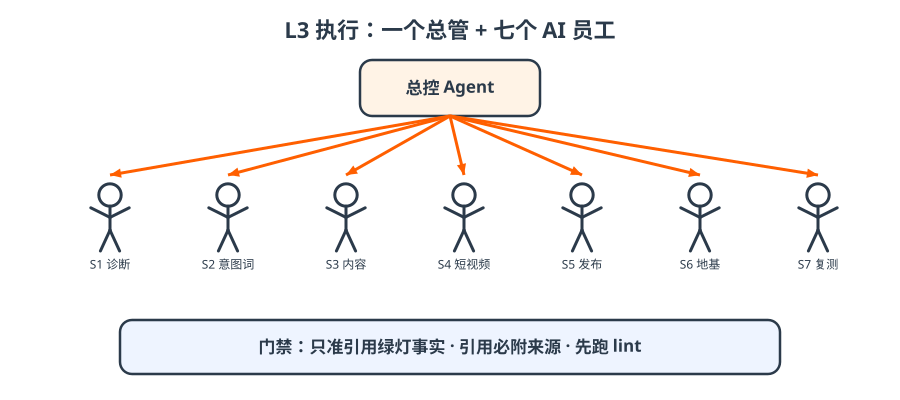

# 6 · L3｜总管和七个员工

- 总控 Agent 读事实库、派任务、出周报；
- 七个 AI 员工：S1 诊断 · S2 意图词 · S3 内容 · S4 短视频 · S5 发布 · S6 官网地基 · S7 复测；
- 门禁三条：只准引用绿灯事实；引用必附来源；干活前先跑 lint。

!!! tip "一句话"
    **别人的 Agent 止于「生成方案」，我们的闭环到「复测分数」。** 平台不限：WorkBuddy 是 v1 参考实现，Claude Code 一条命令安装。

??? question "自测：S3 写了一篇文章，里面提到「客户 300 家」，但事实库里是 draft，怎么办？"
    不能进正文。只能放进「待确认」段，推送飞书待审，老板点「通过」后才变绿灯。
