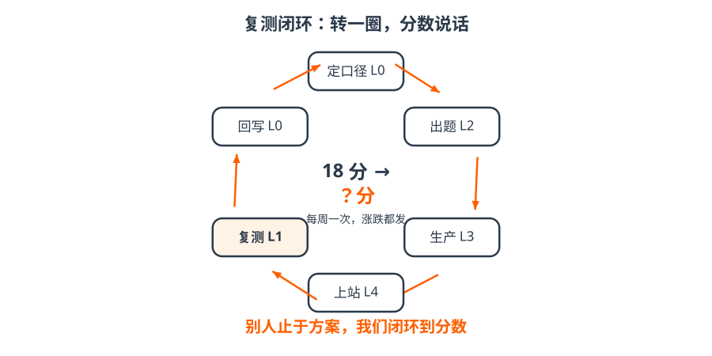

# 7 · 闭环｜转一圈，分数说话

- 定口径（L0）→ 出题（L2）→ 生产（L3）→ 上站（L4）→ 复测（L1）→ 结果写回事实库（L0）；
- 仓桥自己就是第一个客户：基线 18 分，D 级，已公开；
- 每周一次复测，**涨跌都发**——跌了也公开，这才是可信的来源。

!!! tip "一句话"
    转够几圈，所有品牌的分数汇到 **L5 OpenGEO Index**，行业就有了公开的尺子。

??? question "自测：复测结果写回事实库时，verified 写谁？"
    `tool:brand-geo-audit`——机器确认级。它是数据，不是人确认的事实。
