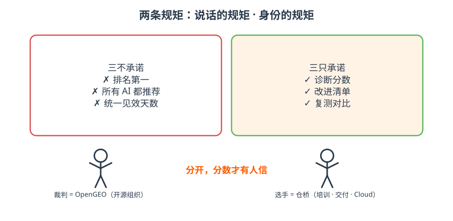

# 8 · 规矩｜裁判和选手

- 说话的规矩：三不承诺、三只承诺、六条白帽红线——违反的 issue / PR 直接关；
- 身份的规矩：**尺子归 OpenGEO 开源组织，生意归仓桥**；OpenGEO Cloud 是仓桥的商业产品，不进开源组织；
- 改尺子要走 RFC：规范字段、评分权重、新引擎、基准 schema，四类变更先提案、两位维护者批准。

!!! tip "一句话"
    行业基准对外只叫 **OpenGEO Index / OpenGEO 可见度指数**。内部代号不上外宣。

??? question "自测：客户问「能保证我们排第一吗」，怎么答？"
    不能，任何人都不能。我们承诺三件事：诊断分数、改进清单、复测对比。然后把避坑指南发给他。
