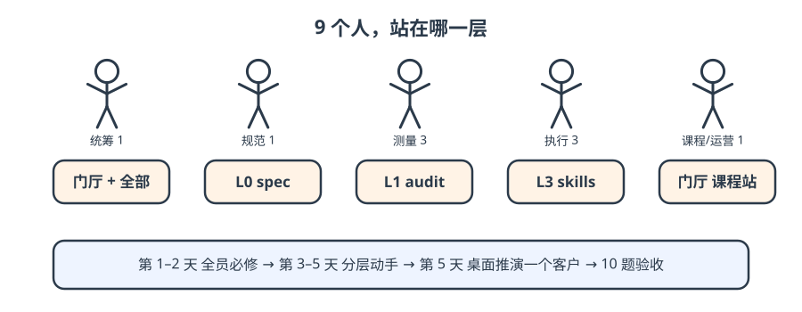

# 9 · 你｜站在哪一层

| 角色 | 人 | 本月交付 |
| --- | --- | --- |
| 统筹 | 1 | 周例会、跨仓看板、双周 release note |
| 规范 L0 | 1 | lint 迭代、行业词表、仓桥 bundle 全绿灯 |
| 测量 L1 | 3 | 三引擎采集器跑通 20 问、仓桥每周一复测 |
| 执行 L3 | 3 | WorkBuddy 七技通关、Claude Code 跑通 S3 |
| 课程/运营 | 1 | 课程站、公开课、社群、release note 分发 |

## 一周学习路径

1. **第 1–2 天**：读 README + GOVERNANCE；本地跑一次 `okf_lint` 和 `run_audit.py`；
2. **第 3–5 天**：按自己那一层动手（详见[全员学习手册](https://github.com/cangqiaoGEO/OpenGEO/blob/main/docs/team-handbook.md)第三部分）；
3. **第 5 天**：全员桌面推演「一个客户从 0 到复测」；
4. **验收**：10 题答对 8 题。

!!! tip "一句话"
    认领 issue 就是上岗：[opengeo-spec](https://github.com/cangqiaoGEO/opengeo-spec/issues) · [opengeo-audit](https://github.com/cangqiaoGEO/opengeo-audit/issues) · [opengeo-skills](https://github.com/cangqiaoGEO/opengeo-skills/issues)
